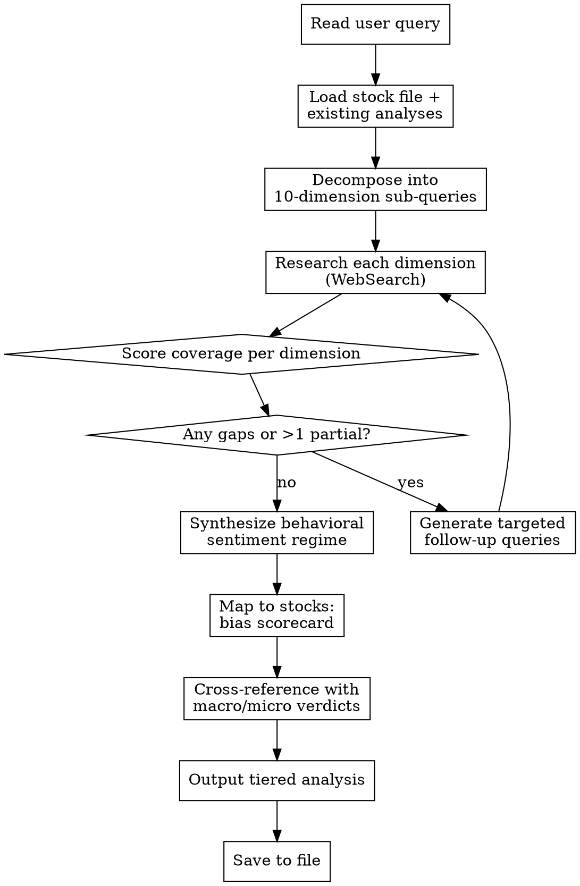

# Behavioral Economics Analyst

Structured methodology for **iterative behavioral economics research** — identifying and measuring systematic cognitive biases at both the aggregate (macro) and firm (micro) level, evaluating coverage gaps, and synthesizing a behavioral sentiment regime that reveals where human psychology is creating gaps between price and fundamental value.

**Goal:** Analyze like a behavioral economist — systematic, bias-aware, evidence-based — not vague "the market feels greedy" hand-waving. Every behavioral claim must be backed by a measurable indicator.

**Relationship to other skills:** This is an **overlay skill**. It does not replace macro-research-analyst or micro-research-analyst — it augments them. Run this skill after or alongside those skills to produce a behavioral adjustment to their verdicts.

## When to Use

- User asks about market sentiment, crowd psychology, or behavioral biases affecting their positions
- User asks "is the market too complacent?" or "is everyone too bearish?"
- User asks whether a stock's price reflects rational fundamentals or narrative/hype
- User wants to understand if consensus is fragile (herding) or robust (independent convergence)
- User asks about management overconfidence, empire-building, or capital allocation biases
- User wants a behavioral overlay on an existing macro or micro analysis
- User asks about FOMO, panic, anchoring, loss aversion, or any named cognitive bias in a market context

## Workflow



---

## Phase 1: Decompose

### Read the Query

Parse the user's question. Even if narrow ("Is the market too complacent about credit risk?"), force research across ALL 10 dimensions — narrow questions get deeper treatment on the focal dimension but never skip the others.

### Load Context

1. Look for stock/portfolio files: `stocks.md`, `portfolio.md`, `watchlist.md`
2. Check `docs/macro-analysis/` for recent macro skill reports (within 30 days)
3. Check `docs/micro-analysis/` for recent micro skill reports (within 30 days)

If macro/micro analyses exist, load their regime verdicts — the behavioral overlay will adjust them.

### Generate Sub-Queries

For each of the 10 mandatory dimensions, generate 2-3 targeted search queries. Queries must be **specific, indicator-named, and current-dated**.

**Bad:** "What is market sentiment?"
**Good:** "AAII investor sentiment survey bullish bearish April 2026"
**Good:** "VIX term structure contango backwardation current 2026"

---

## Phase 2: Research — The 10 Mandatory Dimensions

### Part A: Behavioral Macro Dimensions (Aggregate Psychology)

For each dimension, run **2-3 WebSearch calls**. Extract measurable indicators with dates — not vibes.

### Dimension 1: Sentiment & Narrative Anchoring

Search targets: AAII Investor Sentiment Survey (bull/bear ratio), CNN Fear & Greed Index, put/call ratio (equity + index), consumer confidence vs. actual spending gap, Google Trends for dominant financial narratives ("recession", "AI bubble", "rate cuts"), media sentiment tone (bullish/bearish headline ratio), Michigan Consumer Sentiment vs. hard data divergence.

Key question: **What narrative has the market anchored on, and does the data still support it?**

### Dimension 2: Herding & Crowding

Search targets: CFTC Commitments of Traders (net speculative positioning in key futures), fund flow data (equity/bond/money market — ICI weekly), ETF concentration flows (is everyone piling into the same 3 ETFs?), analyst recommendation clustering (% buy/sell/hold — high consensus = fragile), short interest extremes, NAAIM Exposure Index (active manager positioning).

Key question: **Is the market in a one-way crowded trade, and how fragile is the consensus if the narrative breaks?**

### Dimension 3: Risk Appetite & Complacency Cycle

Search targets: VIX level + VIX term structure (contango = complacent, backwardation = panic), MOVE Index (bond volatility), credit spread compression duration, covenant-lite loan issuance %, SLOOS lending standards trend, financial conditions indices (Chicago Fed NFCI, Goldman Sachs FCI), cryptocurrency/meme stock activity as speculative froth proxy.

Key question: **Has prolonged calm bred disaster myopia, or has recent stress created excess caution — and which is more dangerous for positioning?**

### Dimension 4: Expectations Formation Biases

Search targets: Fed funds futures vs. realized rate path (historical prediction error), Survey of Professional Forecasters dispersion, Michigan/NY Fed inflation expectations (1yr and 5yr) vs. TIPS breakevens gap, earnings estimate revision breadth (% of estimates being revised up vs. down), GDP nowcast vs. consensus gap, "vibecession" indicators (sentiment vs. hard data divergence).

Key question: **Are market expectations anchored on stale data, extrapolating recent trends, or genuinely processing new information?**

### Dimension 5: Animal Spirits & Speculative Excess

Search targets: IPO/SPAC issuance volume and first-day returns, retail trading volume as % of total, options volume (especially 0DTE), margin debt levels (FINRA), crypto market cap and altcoin season index, meme stock activity (social media mention velocity for speculative names), NFIB/CEO confidence surveys, VC funding pace, PE deal multiples.

Key question: **Is capital allocation being driven by rational NPV or by narrative-fueled overconfidence — and how far has speculation extended?**

---

### Part B: Behavioral Micro Dimensions (Firm-Level Psychology)

### Dimension 6: Management Cognitive Biases

Search targets: CEO tenure vs. M&A frequency (empire-building proxy), acquisition goodwill writedowns (sunk cost evidence), management guidance accuracy (historical beat/miss pattern — persistent over-guidance = overconfidence, sandbagging = strategic framing), share buyback timing vs. stock price (procyclical = herding bias), capex announced but later cancelled/written down, earnings call sentiment analysis (tone vs. actual results divergence).

Key question: **Is management systematically overconfident, empire-building, or engaging in procyclical capital allocation?**

### Dimension 7: Customer & Demand Behavioral Dynamics

Search targets: Brand search volume vs. category search volume trend (behavioral salience), NPS vs. actual retention divergence (stated vs. revealed preference), social media mention velocity (social proof fragility), shrinkflation instances, subscription auto-renewal vs. active-use rates, FOMO-driven purchase indicators, pricing tier structure (decoy pricing evidence).

Key question: **Is demand driven by genuine utility or by behavioral fragility (social proof, FOMO, status quo bias) that could evaporate?**

### Dimension 8: Competitive & Industry Behavioral Equilibria

Search targets: Price war history and duration (tit-for-tat behavioral equilibrium), actual customer switching rates vs. theoretical switching costs (status quo bias moat), new entrant failure rate in the industry (overconfidence bias of entrepreneurs), incumbent response lag to disruption (status quo bias + sunk cost fallacy), management commentary sentiment clustering across competitors (industry-level groupthink).

Key question: **Is this industry's competitive stability structural or behavioral — and what would break the behavioral equilibrium?**

### Dimension 9: Market Pricing Biases (Stock-Level)

Search targets: Analyst target price clustering (herding), post-earnings announcement drift evidence (under-reaction / anchoring), 52-week high/low anchoring in price action, retail vs. institutional ownership mix shift, options skew and implied volatility term structure, short interest + days to cover extremes, earnings revision momentum vs. price momentum divergence, P/E relative to narrative cycle (does the multiple expand during "hot story" periods?).

Key question: **Is this stock's price reflecting fundamental value or distorted by anchoring, herding, disposition effects, or narrative premiums?**

### Dimension 10: Governance & Agency Behavioral Risk

Search targets: Board composition homogeneity (groupthink risk), insider selling patterns relative to events, related-party transaction growth vs. revenue growth, auditor changes or qualifications, promoter pledge levels, compensation structure (does pay incentivize short-term earnings management or long-term value creation?), whistleblower complaints or regulatory actions, management turnover pattern.

Key question: **Are governance structures providing genuine oversight, or is behavioral groupthink and agency conflict creating hidden risk?**

---

## Phase 3: Evaluate Coverage

After each research pass, score every dimension:

| Score | Meaning | Criteria |
|-------|---------|----------|
| **Strong** | Clear picture | 3+ recent data points, bias direction is unambiguous |
| **Partial** | Incomplete | Some indicators but missing key sentiment data, or data stale (>4 weeks) |
| **Gap** | No useful data | No meaningful recent behavioral indicators found |

### Coverage Gate

**Do NOT proceed to synthesis until:**
- Zero dimensions scored "Gap"
- At most 2 dimensions scored "Partial" (behavioral data is harder to source than fundamental data)

Maximum 3 research iterations. After 3 passes, proceed with explicit warnings on weak dimensions.

### Coverage Tracker Format

```
Behavioral Coverage Assessment (Pass N):
  MACRO BEHAVIORAL:
    Sentiment & Narrative:       [Strong/Partial/Gap] — key finding
    Herding & Crowding:          [Strong/Partial/Gap] — key finding
    Risk Appetite & Complacency: [Strong/Partial/Gap] — key finding
    Expectations Biases:         [Strong/Partial/Gap] — key finding
    Animal Spirits:              [Strong/Partial/Gap] — key finding
  MICRO BEHAVIORAL:
    Management Biases:           [Strong/Partial/Gap] — key finding
    Customer Demand Behavior:    [Strong/Partial/Gap] — key finding
    Industry Equilibria:         [Strong/Partial/Gap] — key finding
    Market Pricing Biases:       [Strong/Partial/Gap] — key finding
    Governance & Agency Risk:    [Strong/Partial/Gap] — key finding

  Gate: [PASS/FAIL — N gaps, M partial]
```

---

## Phase 4: Synthesize Behavioral Sentiment Regime

### Regime Classification

Classify the current aggregate behavioral environment:

| Regime | Characteristics |
|--------|----------------|
| **Euphoria / Peak Greed** | Extreme bullish sentiment, crowded longs, compressed VIX, speculative excess (meme stocks, IPO frenzy), disaster myopia, "this time is different" narratives |
| **Complacency** | Moderately bullish, low volatility accepted as normal, risk appetite high but not extreme, consensus confident but not manic |
| **Rational Equilibrium** | Sentiment balanced, positioning not crowded, expectations roughly matching data, healthy skepticism present |
| **Anxiety / Uncertainty** | Elevated uncertainty, conflicting narratives, frequent sentiment swings, positioning reducing but not capitulating |
| **Fear / Panic** | Extreme bearish sentiment, VIX elevated, crowded shorts/cash hoarding, availability bias amplifying bad news, normalcy bias collapsing |
| **Capitulation** | Maximum pessimism, indiscriminate selling, "no one will ever buy stocks again" narratives, but often marks bottoms |
| **Skeptical Recovery** | Improving data but market refuses to believe it — anchored on recent pain, under-positioned for recovery |

### Regime Narrative Structure

1. **Regime label** and confidence level (high / moderate / low)
2. **Dominant behavioral force** — the single most powerful bias shaping the market right now
3. **Behavioral amplifier** — is psychology amplifying or dampening the fundamental reality?
4. **Fragility assessment** — how fragile is the current behavioral equilibrium? What breaks it?
5. **Counter-bias** — what is the market NOT seeing because of the dominant bias? (Complacent markets miss tail risks. Panicked markets miss value.)

---

## Phase 5: Map to Stocks

For each stock, produce a **Behavioral Bias Scorecard**:

```
Behavioral Bias Scorecard: [TICKER]
  Aggregate Behavioral Impact:
    Sentiment:     [Amplifying / Dampening / Neutral] — explanation
    Herding:       [Crowded Long / Crowded Short / Uncrowded] — evidence
    Complacency:   [Complacent / Cautious / Fearful] — sector-specific
  Firm-Level Behavioral Impact:
    Management:    [Overconfident / Disciplined / Defensive] — evidence
    Demand Basis:  [Structural / Behavioral / Mixed] — fragility assessment
    Pricing Bias:  [Overvalued by bias / Undervalued by bias / Fair] — which bias and direction
```

### Behavioral Adjustment to Verdicts

Cross-reference with existing macro/micro verdicts:

| Macro/Micro Verdict | Behavioral Regime | Net Adjustment |
|---------------------|-------------------|----------------|
| Bullish + Euphoria | **Reduce conviction** — fundamentals good but priced + behavioral premium |
| Bullish + Fear/Panic | **Increase conviction** — fundamentals good and behavioral discount exists |
| Bearish + Euphoria | **Strong avoid / Short candidate** — fundamentals bad and behavioral premium inflating price |
| Bearish + Fear/Panic | **Watch for overcorrection** — fundamentals bad but price may overshoot to downside |
| Neutral + Crowded trade | **Caution** — positioning fragility matters more than direction |

```
Behavioral Adjustment: [TICKER]
  Macro verdict:       [from macro-research-analyst, if available]
  Micro verdict:       [from micro-research-analyst, if available]
  Behavioral regime:   [Euphoria / Complacency / ... ]
  Behavioral bias:     [Amplifying bullish / Amplifying bearish / Dampening / Neutral]
  Adjustment:          [Increase conviction / Reduce conviction / No change / Flip direction]
  Net recommendation:  [Actionable statement with time horizon]
```

---

## Phase 6: Tiered Output

### Tier 1 (Always shown): Behavioral Regime Verdict

The user should understand the behavioral landscape in 60 seconds.

```
Behavioral Sentiment Regime: [Label]
  Confidence:       [High / Moderate / Low]
  Dominant Bias:    [Named bias — one sentence]
  Market Fragility: [High / Moderate / Low] — what breaks it
  Blind Spot:       [What the dominant bias is hiding]
```

### Tier 2 (Always shown): Stock Behavioral Scorecard

| Ticker | Behavioral Regime Impact | Crowding Risk | Management Bias | Demand Fragility | Pricing Bias | Net Adjustment |
|--------|--------------------------|---------------|-----------------|------------------|--------------|----------------|
| AAPL | Complacency dampens upside | Crowded long | Disciplined | Structural | +5% narrative premium | Reduce size |
| XOM | Fear creates opportunity | Uncrowded | Overconfident capex | Cyclical | -10% panic discount | Increase size |

### Tier 3 (On request): Behavioral Playbook

- Contrarian entry triggers ("add when Fear & Greed Index drops below 20 AND fundamentals are intact")
- Bias decay timeline estimates ("narrative premiums typically erode over 3-6 months post-catalyst")
- Behavioral hedges ("if crowded long, buy put protection at low IV")
- Key sentiment data release dates to monitor

---

## Cross-Referencing with Macro & Micro Skills

This skill is designed to **overlay** the macro-research-analyst and micro-research-analyst verdicts.

**If macro analysis exists** (`docs/macro-analysis/` dated within 30 days): Load the regime and ask — "Is the behavioral environment amplifying or dampening this macro regime?" A Stagflation macro regime during Euphoria behavioral regime is extremely dangerous. A Goldilocks macro regime during Fear behavioral regime is a buying opportunity.

**If micro analysis exists** (`docs/micro-analysis/` dated within 30 days): Load business quality verdicts and ask — "Is the market pricing this company's quality correctly, or is a behavioral bias creating a gap?" A Compounder during Panic is mispriced. A Value Trap during Euphoria is doubly dangerous.

---

## Output Persistence

Save the full analysis to `docs/behavioral-analysis/YYYY-MM-DD-<topic-slug>.md` using the report template in [report-template.md](report-template.md).

---

## Data Sources Quick Reference

For the complete data access guide with URLs and access tiers, see [data-sources.md](data-sources.md).

| Category | Key Sources |
|----------|------------|
| Sentiment surveys | AAII, Michigan, Conference Board, NFIB, CNN Fear & Greed |
| Positioning | CFTC COT, ICI fund flows, NAAIM, 13-F filings, FINRA margin debt |
| Volatility & risk | VIX/MOVE (CBOE), credit spreads (FRED), NFCI (Chicago Fed) |
| Expectations | CME FedWatch, SPF (Philadelphia Fed), NY Fed SCE, TIPS breakevens (FRED) |
| Speculative activity | IPO data (Renaissance Capital), options volume (CBOE), retail flow proxies |
| Firm-level behavioral | Earnings transcripts (Seeking Alpha/Tikr), SEC Form 4, proxy statements |
| Social/narrative | Google Trends, Reddit, StockTwits, Twitter/X |

---

## Common Mistakes

| Mistake | Fix |
|---------|-----|
| "The market feels greedy" without measurable indicators | Every behavioral claim needs a number: AAII bull %, VIX level, put/call ratio, etc. |
| Treating behavioral analysis as contrarian trading | Behavioral analysis identifies biases — sometimes the crowd is right. The question is fragility, not direction. |
| Running behavioral analysis without fundamental context | This is an overlay skill. Without macro/micro verdicts to adjust, behavioral analysis is just sentiment watching. |
| Assuming all sentiment extremes mean-revert immediately | Extremes can persist for months. Identify the catalyst that would break the behavioral equilibrium. |
| Conflating social media noise with positioning data | Reddit posts ≠ market positioning. Always check actual flows (COT, fund flows) not just narrative volume. |
| Same behavioral verdict for all stocks | Sector-level behavioral dynamics differ. Tech may be in euphoria while energy is in fear simultaneously. |
| Ignoring management behavioral biases | Firm-level biases (CEO overconfidence, board groupthink) are the most underappreciated behavioral risk. |

## Red Flags — STOP and Reassess

- You're about to call the market "euphoric" or "panicked" without citing 3+ quantitative indicators → go back
- All your searches are generic ("market sentiment 2026") instead of indicator-specific → rewrite queries
- You haven't printed a coverage tracker → you skipped Phase 3
- Your behavioral regime has no fragility assessment → add one
- A stock behavioral adjustment has no time horizon → add it
- You're recommending pure contrarian trades without checking fundamental support → behavioral discounts on bad businesses are not opportunities
- You haven't checked for existing macro/micro analyses to cross-reference → check before outputting
