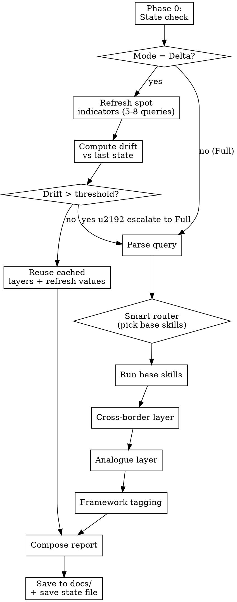
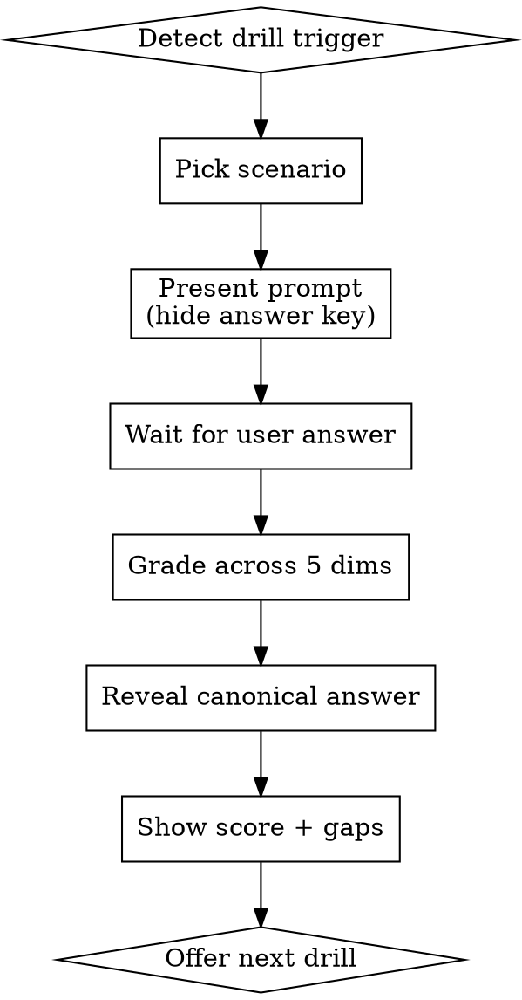

# Cross-Regime Research Analyst

Composite skill that orchestrates the four base analysts (macro, micro, behavioral, microstructure) and adds the persistent teaching layer they lack: cross-border spillover reasoning with quantified transmission chains, historical regime matching with differential diagnosis, explicit framework tagging in every claim, and graded drill scenarios for multi-regime practice.

**Goal:** Convert applied analysis into transferable understanding. The user should be able to reason about any country, any shock, any regime — citing named frameworks and quantified elasticities, not vibes.

## When to Use

- User asks how a shock in country/region A affects country B (e.g., "Europe gas crisis → US prices", "Fed hike → India FII flows", "China stimulus → metals → AU/BR equities")
- User wants the current setup matched to a historical analogue
- User asks "which framework explains this?" or wants frameworks named explicitly
- User invokes drill mode to practice on a synthetic scenario ("test me", "drill me", "give me a scenario")
- User asks for a learning-focused report instead of a trade verdict

## When NOT to Use

- Pure intraday order-book reading → use `market-microstructure-analyst` directly
- Single-country, single-regime current verdict with no learning goal → use `macro-research-analyst` directly
- Pure company fundamentals with no macro context → use `micro-research-analyst` directly

## Three Run Modes

The skill has three modes. **Mode selection is automatic** based on the user's query and the state file — explained in Phase 0 below.

### Mode A — Full Report

Complete pipeline. Produces a learning-rich macro/micro report enriched with:
- Cross-border transmission chain with quantified elasticities
- Top 2 historical analogues with differential diagnosis
- Inline `[framework-tag]` on every analytical claim
- "Frameworks Used" appendix
- Saves state file at the end (Phase 7)

**Token cost: high** (~25-35 WebSearches). Run once per week, after major events, or whenever the user explicitly asks for a "full" run.

### Mode B — Delta Report

Light pipeline. Reads the last full-run state file, refreshes only the cheap spot indicators, computes drift, and reuses cached cross-border + analogue + framework work where the underlying state hasn't moved enough to invalidate it.

**Token cost: low** (~5-10 WebSearches). Run daily during active trading.

### Mode C — Drill

Pure practice. No WebSearch. Reads `drills.md`, presents a scenario, grades the user's answer.

**Token cost: near-zero.** Run any time without budget concern.

### Mode Selection Decision Tree

```
1. Does the user query contain a drill trigger ("drill", "practice", "test me", "scenario")?
   → Mode C (Drill). Skip everything else.

2. Does the query contain an explicit "full" / "fresh" / "from scratch" / "deep" signal?
   → Mode A (Full).

3. Is there an event trigger today? (CPI/PMI/GDP print, central-bank meeting, war news, > 3σ market move on any tracked indicator)
   → Mode A (Full).

4. Is there a state file at state/<destination>-last-run.json AND it is < 7 days old?
   → Mode B (Delta).

5. No state file OR state file > 7 days old?
   → Mode A (Full).
```

The agent must announce the chosen mode at the start of every run: *"Running in [Full | Delta | Drill] mode because <reason>."*

---

## Workflow — Report Mode (Full and Delta)



### Phase 0: State Check (runs first, regardless of mode)

1. Read `state/<destination>-last-run.json` if it exists. If not, force Mode A (Full) and skip the rest of Phase 0.
2. Read the timestamp. If > 7 days old, force Mode A.
3. If Mode A is forced, skip to Phase 1.
4. Otherwise (Mode B candidate): refresh **only** the spot indicators via WebSearch:
   - For India destination: Brent crude, USD/INR, NIFTY 50 close, India 10y G-Sec yield, India VIX, top 3 news headlines
   - For US destination: Brent or WTI, DXY, S&P 500 close, US 10y yield, VIX, top 3 news headlines
   - For other destinations: equivalent set (oil/gas, FX vs USD, equity index, 10y yield, vol index)
   - Cap at 8 WebSearch calls total
5. Build today's feature vector using these refreshed values (interpolate any unchanged features from the cached vector).
6. Compute weighted Euclidean distance to the cached vector (same weights as `regimes.md`).
7. **Drift decision:**

   | Drift score | Action |
   |---|---|
   | < 0.20 | **Delta-light**: reuse cached cross-border / analogue / framework sections; refresh only the "current value" cells in tables. Skip Phases 2-5 entirely. |
   | 0.20 - 0.50 | **Delta-medium**: reuse cached analogue match and framework set; re-run only Phase 3 (cross-border) for the channels whose indicator moved > 1σ. |
   | > 0.50 | **Escalate to Full**: announce that drift exceeded the delta threshold and run the complete Mode A pipeline. |

8. **Event trigger override:** if any of the top-3 news headlines mention any of: `[Fed, RBI, ECB, war, ceasefire, attack, default, downgrade, CPI, payrolls, GDP, election]`, escalate to Full regardless of drift score.
9. Announce the resolved mode and rationale before doing further work: e.g., *"Delta-light: drift score 0.12 vs cached 2026-04-30 state. Reusing cached analogue (2022 Europe gas, similarity 0.42) and frameworks. Refreshing 6 indicator values."*

### Phase 1: Parse Query

Extract:
- `source` — country/region/asset where shock originates (e.g., Europe, Fed, OPEC, China)
- `destination` — country/region/asset of impact (default: India if user has `stocks.md`, else ask)
- `shock_type` — one of: `supply_shock`, `demand_shock`, `monetary_tightening`, `monetary_easing`, `currency_crisis`, `banking_crisis`, `trade_war`, `geopolitical_war`, `liquidity_event`, `fiscal_expansion`, `fiscal_contraction`
- `regime_question` — true if the query is "what regime are we in?" rather than "what's the spillover?"

If any field is ambiguous, ask once via `AskQuestion`. Do not guess.

### Phase 2: Smart Router

Decide which base skills to invoke:

| Query indicator | Base skills to invoke |
|---|---|
| "macro", "regime", "Fed", "RBI", "inflation", "GDP" | macro |
| Specific tickers, "fundamentals", "moat", "earnings", "unit economics" | macro + micro |
| "sentiment", "consensus", "narrative", "FOMO", "panic", "complacent" | macro + behavioral |
| "intraday", "order book", "option chain", "VWAP", "L2" | microstructure (only) |
| "spillover", "ripple", "affect", "impact on", country pairs | macro + cross-border layer (always added) |
| "compare to", "history", "analogue", "like 2008", "similar to" | macro + analogue layer (always added) |

**Default invocation:** `macro` + cross-border layer + analogue layer + framework tagging.

Invoke base skills with their normal protocol (they each load `stocks.md` from workspace root). Capture their structured outputs.

### Phase 3: Cross-Border Layer (the v0.1 IP)

This is what the base macro skill alone cannot do. Procedure:

1. **Look up channels** for `(source, destination, shock_type)` in [`elasticities.md`](elasticities.md). Each shock type has a defined channel set (trade, FX, banking, commodity, sentiment, policy).
2. **Fetch live linkage indicators** via `WebSearch` for current values of each channel's key indicator (DXY, EM spreads, oil price, FX rate, etc.).
3. **Apply quantified elasticities** from `elasticities.md` to compute the implied impulse on the destination economy. Every link must produce a *number* and a *time lag*.
4. **Build the transmission chain** as: `shock → first-order effect → second-order effect → … → destination indicator`.
5. **Tag every link** with the framework(s) that justify it.

**Output schema for the cross-border section:**

```
Channel: <trade | FX | banking | commodity | sentiment | policy>
  Indicator: <name>, current value <X>, change <Y>
  Elasticity: <"X% move → Y bps impact in N months">
  Lag: <N months>
  Framework: [<tag from frameworks.md>]
  Implied impulse on destination: <quantified>
```

Every claim in this layer must include a number, a lag, and a framework tag. If any of these is missing, mark the link `[heuristic — no formal framework]` so the user can see the softer reasoning.

### Phase 4: Regime Layer

The regime layer has two sub-phases. Phase 4a is **always run**. Phase 4b is **opt-in only**, gated by a strict similarity threshold and explicit user request.

This split reflects a deliberate epistemic stance: archetype-class base rates are empirically validated as predictive (Tetlock); single-event historical analogues are anchoring traps when forced. Phase 4b only fires when the data *demands* it AND the user explicitly asks for historical context.

#### Phase 4a: Archetype Classification (always run)

Mandatory in every Full report. Steps:

1. **Build today's feature vector** across the 12 dimensions:
   `[growth, headline_inflation, oil_zscore, USD_zscore, real_10y_yield, HY_OAS_zscore, equity_drawdown_3m, FX_vol, geopolitical_flag, fiscal_stance, monetary_stance, banking_stress_flag]`
2. **Classify into one of the 8 archetypes** in [`archetypes.md`](archetypes.md) based on which archetype's signature best fits the feature vector. May be a *blend* of two archetypes if the vector spans both (e.g., "supply shock with monetary-tightening overlay").
3. **Cite archetype-class base rates** from `archetypes.md` for the matched archetype:
   - Historical incidence rate (how often this archetype occurs)
   - Median duration
   - Median equity drawdown
   - Median sector dispersion (winner-loser spread)
   - Modal resolution path
4. **Apply the sector × archetype beta heuristics** from `archetypes.md` to seed sector verdicts (the cross-border layer in Phase 3 then refines based on country-specific exposure).

Output is a *taxonomy claim* + *base rate context*, not a forecast anchored to any one historical event.

#### Phase 4b: Historical Analogue Match (opt-in only)

This sub-phase is **default-off**. It runs only when BOTH of these conditions are met:

1. **User explicitly requests historical context** — phrases like "what historical episodes resemble this?", "is this like 2008?", "give me historical comparables", "what's the closest analogue?"
2. **Top similarity score is genuinely strong** — best match against the catalog in [`regimes.md`](regimes.md) has weighted Euclidean distance < 0.60 (lower = more similar)

If condition 1 is met but condition 2 is not, output **exactly this** instead:

> *"No historical regime in the catalog is a strong match (best similarity score: X.XX, threshold: 0.60). Today's regime is novel within the `<archetype>` class. Treating it as such avoids forcing a misleading analogue."*

If both conditions are met, run the analogue match procedure:

1. Score the catalog and surface up to 2 analogues with similarity < 0.60
2. For each: similarity score; 3 most-similar dimensions; 2 most-different dimensions (**differential diagnosis is mandatory** — it's the antidote to anchoring)
3. State the historical resolution path AND explicitly note the dimensions where today differs from the analogue's pre-resolution conditions — these are where the analogue's playbook is *least* applicable today
4. End with this disclaimer:

> *"Historical analogues are reality-checks on framework predictions, not forecasts. The framework-derived chain in Section 3 is the primary basis for any decisions; this section provides historical base-rate context only."*

**Hard rule:** the agent must never auto-trigger Phase 4b based on its own judgment that "history is interesting here." User must ask.

### Phase 5: Framework Tagging

The framework glossary lives in [`frameworks.md`](frameworks.md). Tagging convention:

- **Inline:** every analytical claim ends with `[framework-name]`. Examples:
  - "$10 Brent rise widens India CAD by ~0.4% of GDP `[CAD identity]`"
  - "10y yield → mortgage → consumption transmits with a 6-9 month lag `[Fed transmission mechanism]`"
- **Multi-tag:** combine with `+`: `[CAD identity + USD pass-through]`
- **Heuristic flag:** if no formal framework applies, write `[heuristic]` so the user knows the claim is softer than tagged claims
- **Appendix:** every report ends with a "Frameworks Used" section listing each tagged framework with a 2-3 line definition pulled from `frameworks.md`

If a tag is used that is not yet in `frameworks.md`, **add it to the glossary** in the same run. The glossary is meant to grow.

### Phase 6: Compose Report

Use [`report-template.md`](report-template.md). Required sections:

1. Executive summary (3-5 lines)
2. Macro context (from base skills' output)
3. **Cross-border transmission chain** (Phase 3 output)
4a. **Archetype classification + base rates** (Phase 4a output, always present)
4b. **Historical analogue match** (Phase 4b output, OPT-IN ONLY — present only if the user requested historical context AND a strong-match catalog entry exists)
5. Stock/sector mapping (from base skills' output, retagged with framework tags)
6. Trade implications (only if the user asked for them)
7. **Frameworks Used** appendix (Phase 5 output)
8. Risks & invalidation

Save to `docs/macro-analysis/YYYY-MM-DD-<topic-slug>.md`.

### Phase 7: Save State (Full mode only)

After saving the report, persist the run's structured outputs to `state/<destination>-last-run.json`. This is what enables future delta runs to skip recomputation.

**Schema:**

```json
{
  "timestamp": "ISO-8601",
  "mode": "full",
  "destination": "india",
  "source_shock": "iran_war_oil_supply",
  "archetype": "geopolitical_war_supply_shock",
  "feature_vector": {
    "growth": 6.9,
    "headline_inflation": 3.4,
    "oil_zscore": 2.2,
    "USD_zscore": 0.5,
    "real_10y_yield": 1.8,
    "HY_OAS_zscore": 0.4,
    "equity_drawdown_3m": -8,
    "FX_vol": 8,
    "geopolitical_flag": 1,
    "fiscal_stance": -0.4,
    "monetary_stance": -0.5,
    "banking_stress_flag": 0
  },
  "live_indicators": {
    "brent": 120,
    "dxy": 102,
    "usdinr": 88,
    "nifty50": 24196,
    "india_10y": 6.93,
    "india_vix": 18.5
  },
  "top_analogues": [
    {"name": "2022_europe_gas_crisis", "similarity": 0.42, "differential": "no simultaneous Fed tightening today"},
    {"name": "1973_OPEC_embargo", "similarity": 0.58, "differential": "today has central-bank reaction function; 1973 had accommodation"}
  ],
  "frameworks_tagged": ["CAD identity", "USD pass-through", "Fed-EM transmission", "real-vs-nominal"],
  "report_path": "docs/macro-analysis/2026-04-30-india-iran-shock.md",
  "next_event_triggers": ["RBI MPC Jun-6", "India CPI May-12", "US-Iran talks Apr-28"]
}
```

In **delta** runs, save a compact update:

```json
{
  "timestamp": "ISO-8601",
  "mode": "delta-light" | "delta-medium",
  "based_on_full_run": "2026-04-30T20:30:00",
  "drift_score": 0.12,
  "live_indicators": { /* updated values */ },
  "feature_vector_diff": { /* changed dimensions only */ }
}
```

Delta runs append to a per-day rolling log: `state/<destination>-deltas-YYYY-MM-DD.jsonl`. The next Full run consumes these deltas to compute drift trajectory across the week.

---

## Workflow — Drill Mode



### Drill Triggers

User says any of: "drill", "practice", "test me", "quiz me", "give me a scenario", "let me try", or asks for a specific archetype to practice.

### Drill Format — Synthetic / Parameter-Driven Only

**Drills are synthetic**: prompts contain no country names, no dates, no real-world anchors. They specify scenarios via numerical/structural parameters only (import dependency %, FX reserves cover, currency regime, debt composition, sectoral mix). This is intentional — it forces the user to reason from frameworks and elasticities rather than pattern-match to a remembered story.

The agent must NEVER reframe a synthetic drill as a historical re-enactment in the prompt, even if the user asks "give me a 2008-style drill." Instead, pick a synthetic drill whose archetype matches what the user wants to practice (in this example, Drill 5 — Banking Deleveraging Cascade).

### Drill Selection

If user names an archetype/topic, pick a drill from [`drills.md`](drills.md) whose archetype matches. Otherwise pick by least-practised archetype (track in `state/drill-history.json` if writable; else random).

### Presenting the Drill

- Show only the parameter-driven prompt and the "what to answer" instructions
- **Never reveal the canonical answer, the historical comparable, or the answer key before the user responds**
- Tell the user the 5 grading dimensions up front so they know what to address
- Tell the user that a Historical Comparable section will appear after grading as a reality-check

### Grading Rubric (5 dimensions × 1-5 points = 25 max)

1. **Transmission-chain completeness** — Did the user identify all the major channels (trade, FX, banking, commodity, sentiment, policy) that apply?
2. **Quantified elasticities** — Did each link include a number and a lag, or was it qualitative hand-waving?
3. **Framework citations** — Did the user name the frameworks they used (CAD identity, sectoral balances, transmission mechanism, etc.)?
4. **Counter-signals / contradictions** — Did the user identify what could invalidate their thesis?
5. **Time-horizon clarity** — Did the user distinguish near-term, medium-term, and structural impacts?

Score each dimension 1-5 with one-line justification.

### Reveal & Reflection (in this exact order)

1. **Per-dimension scores (1-5 each)** with one-line justification per dimension
2. **Canonical answer** — the framework-derived transmission chain
3. **Historical Comparable section** — reveals which real-world episode(s) most resemble the synthetic scenario, AND identifies dimensions where the actual outcome diverged from the framework prediction. The divergence is itself a lesson on the limits of pure first-principles reasoning.
4. **Single biggest gap** in the user's answer with what to focus on
5. **Next drill recommendation** — preferably one targeting the user's weakest dimension or an archetype they've practised least

The Historical Comparable is *not* the answer key. The framework-derived chain is the answer key. The historical case shows where reality diverged from theory — a deliberate exposure to the limits of any pure-framework approach.

---

## Operating Rhythm — Trading Focus

Recommended cadence for trading-focused use. The skill enforces the technical mode-selection rules; the user controls when to invoke.

| Day / event | Mode | Purpose | Approx WebSearches |
|---|---|---|---|
| **Monday morning** | Full | Set the weekly baseline — fresh regime classification, analogue match, framework tagging | ~25-35 |
| **Tue-Fri morning** | Delta | Quick refresh of spot indicators; reuse cached layers if drift < threshold | ~5-10 |
| **CPI / PMI / GDP print day** | Full (forced by event trigger) | Major data print invalidates the regime feature vector | ~25-35 |
| **Central bank meeting day** | Full (forced by event trigger) | Policy stance shift can flip the archetype | ~25-35 |
| **Geopolitical news event** | Full (forced by event trigger) | War / ceasefire / sanctions news | ~25-35 |
| **Earnings cluster** (e.g., big-tech or bank week) | Delta + invoke `micro-research-analyst` separately for affected stocks | Add micro layer without reclassifying regime | ~10-15 |
| **Weekend** | Drill (Mode C) | Practice on archetypes you've encountered least | ~0 |

**Key efficiency rule:** never invoke this skill twice in the same trading session unless an event trigger has fired. If the user asks again, point to the existing report in `docs/macro-analysis/` and offer a delta refresh instead.

### Per-destination state separation

State files are keyed by destination country: `state/india-last-run.json`, `state/us-last-run.json`, etc. Running a Full report for India does not invalidate the US state. Switching destinations mid-week → expect a Full run for the new destination on first invocation.

### Manual overrides

User can force a specific mode via query keywords:
- `"full"`, `"fresh"`, `"from scratch"`, `"deep"` → Mode A (Full)
- `"quick"`, `"refresh"`, `"delta"`, `"what changed"` → Mode B (Delta)
- `"drill"`, `"practice"`, `"test me"`, `"scenario"` → Mode C (Drill)

The agent must respect manual overrides over its own mode-selection logic.

---

## Reference Files

| File | Purpose | Read by mode |
|---|---|---|
| [`frameworks.md`](frameworks.md) | Named frameworks with definitions, variables, worked examples, common misuses | Full, Delta, Drill |
| [`regimes.md`](regimes.md) | Historical regime catalog with fixed schema + similarity scoring spec | Full; Delta (drift-distance only) |
| [`elasticities.md`](elasticities.md) | Quantified transmission rules across channels | Full; Delta-medium (only changed channels) |
| [`archetypes.md`](archetypes.md) | Regime archetypes with sector winners/losers and characteristic indicator profiles | Full |
| [`drills.md`](drills.md) | Graded scenarios, answer keys, and the 5-dimension rubric | Drill only |
| [`report-template.md`](report-template.md) | Output report structure | Full, Delta |
| `state/<destination>-last-run.json` | Cached structured outputs from last Full run | Read in Phase 0; written in Phase 7 |
| `state/<destination>-deltas-YYYY-MM-DD.jsonl` | Rolling log of intra-week delta runs | Appended in Phase 7 (delta mode) |

The glossary grows: when the agent uses a framework, elasticity, or regime not yet in the references, it must add the entry in the same run before completing the report.

---

## Common Mistakes

| Mistake | Fix |
|---|---|
| Stating a transmission chain without numbers | Every link needs an elasticity from `elasticities.md` or a `[heuristic]` flag |
| Naming an analogue without differential diagnosis | The differing features matter more than matching ones — always surface them |
| Auto-running Phase 4b without explicit user request | Phase 4b is opt-in. Default reports show 4a only. Auto-triggering it reintroduces the anchoring bias the demotion was designed to remove. |
| Forcing a Phase 4b analogue when similarity > 0.60 | Output the "no strong match" disclaimer instead. Forcing a weak match misleads more than it informs. |
| Skipping Phase 4a base-rate citation | 4a is mandatory. Without base rates, the archetype classification is just a label without context. |
| Tagging a claim with a framework not in `frameworks.md` | Add the framework to the glossary in the same run |
| Drill mode showing the answer key before the user answers | Wait for the user's answer first, grade, then reveal |
| Running the cross-border layer for a single-country query | Skip Phase 3 if no source/destination pair is implied |
| Repeating macro skill's output verbatim | The composite skill adds layers; if the output is identical to running `macro-research-analyst` alone, the cross-border + analogue + tagging layers were skipped |
| Skipping Phase 0 and running Full every time | Phase 0 is mandatory and must run first. Defaulting to Full when delta would suffice burns 3-4× the token budget. |
| Running Full mode without saving state in Phase 7 | Without state, every future run defaults back to Full. Always persist state at the end of a Full run. |
| Delta mode reusing cached layers when drift > 0.50 | Drift threshold breach must escalate to Full, not silently reuse stale layers |
| Failing to announce the chosen mode at the start of the run | The user must know which mode is running and why; announce it explicitly before doing further work |

## Red Flags — STOP and Reassess

- Output has zero `[framework-tag]` tags → tagging discipline broken; restart Phase 5
- Phase 4a (archetype classification + base rates) missing → re-run Phase 4a; it is mandatory in every Full report
- Phase 4b (analogue match) appearing in report when user did not explicitly request it → remove section 4b; output 4a only
- Phase 4b included with similarity > 0.60 → replace with "no strong match" disclaimer
- Transmission chain has no numbers or lags → re-run Phase 3 with elasticities
- Drill graded without per-dimension rubric scores → grading is incomplete
- Drill answer revealed before user attempted → invalid drill, restart with a fresh scenario
- Phase 0 was skipped → restart from Phase 0 to determine correct mode
- Full mode completed without writing state file → write it now before responding to the user
- Mode chosen does not match the announced rationale → re-evaluate Phase 0 decision tree
- Delta mode used > 5 days after last Full run → escalate to Full; the cached state is too stale
