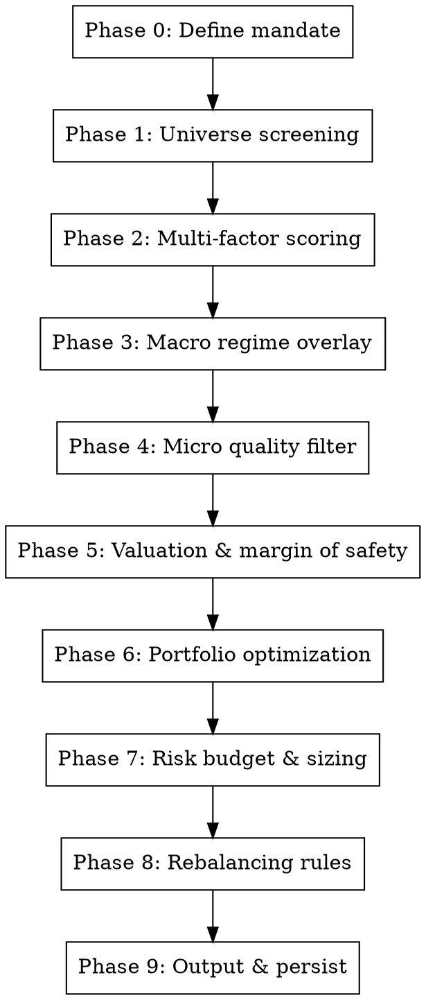
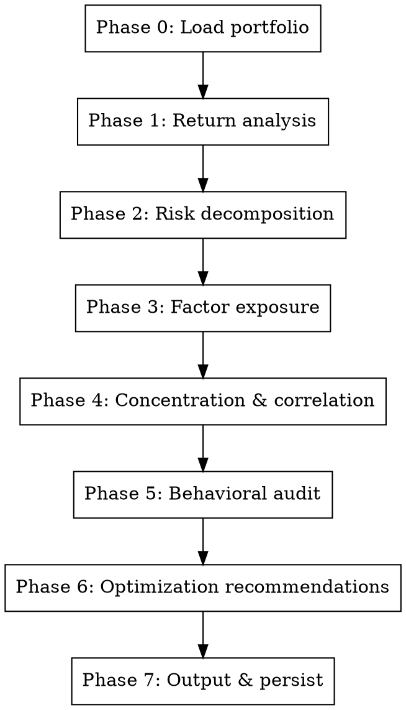

# Investment Management — Index-Beating Portfolio Construction & Active Rebalancing

Composite orchestration skill that synthesizes **macro-research-analyst**, **micro-research-analyst**, **behavioral-economics-analyst**, **cross-regime-research-analyst**, and adds a persistent **quantitative portfolio construction layer** — factor models, risk decomposition, optimization under constraints, active rebalancing triggers, and personal portfolio health diagnostics.

**Goal:** Build and maintain a concentrated portfolio (8-25 positions) that maximizes the probability of beating the best-performing global index over rolling 1-year, 3-year, and 5-year windows — using only strategies backed by replicated academic evidence, not curve-fit backtests or narrative conviction alone.

**Philosophy:** Value investing provides the *what* (intrinsic value as the anchor), macro analysis provides the *when* (regime-aware timing), micro analysis provides the *which* (business quality selection), quantitative finance provides the *how much* (sizing, risk budgeting, and rebalancing rules). Behavioral analysis provides the *contrarian edge* (where psychology has created price-value gaps).

## When to Use

- User asks to build a portfolio that beats an index (S&P 500, NIFTY 50, MSCI World, etc.)
- User asks for portfolio construction with factor exposure management
- User provides a group of stocks and asks for optimal allocation with rebalancing
- User asks to analyze their personal portfolio for risk, returns, stability, drawdown, correlation
- User asks "how do I maximize returns while controlling drawdown?"
- User asks about rebalancing frequency, trigger-based rebalancing, or portfolio drift management
- User asks for quantitative portfolio metrics (Sharpe, Sortino, Calmar, max drawdown, tracking error, information ratio)
- User wants factor decomposition of their portfolio (value, momentum, quality, size, volatility exposure)
- User asks about position sizing using Kelly criterion or risk parity
- User asks "is my portfolio well-diversified?" or "where is my hidden risk?"
- User provides a set of stocks and a time horizon and wants an active management strategy

## When NOT to Use

- Pure intraday trading → use `market-microstructure-analyst`
- Single stock fundamental analysis without portfolio context → use `micro-research-analyst`
- Macro outlook without portfolio mapping → use `macro-research-analyst`
- Cross-border spillover without portfolio action → use `cross-regime-research-analyst`

---

## Two Operating Modes

### Mode A — Fund Portfolio Construction (Build & Rebalance)

Given a universe of stocks (or sectors/geographies), construct an optimized portfolio with explicit factor tilts and rebalancing rules designed to beat a specified benchmark index.

### Mode B — Personal Portfolio Analysis (Diagnose & Optimize)

Given the user's existing holdings (with quantities, entry prices, and current values), diagnose the portfolio's health across risk/return/stability dimensions and provide research-backed recommendations to maximize risk-adjusted returns.

**Mode selection:** Automatic from query intent. If the user says "build", "construct", "create a fund", "beat the index" → Mode A. If the user says "analyze my portfolio", "what's my risk", "how can I improve returns" → Mode B. If ambiguous, ask.

---

## Mode A: Fund Portfolio Construction

### Workflow



---

### Phase 0: Define the Investment Mandate

Extract from user query (or ask via `AskQuestion`):

| Parameter | Description | Default |
|-----------|-------------|---------|
| `benchmark` | Index to beat | S&P 500 (US) or NIFTY 50 (India) based on stock universe |
| `universe` | Stock pool to select from | Load from `stocks.md` / `portfolio.md` / `watchlist.md` |
| `time_horizon` | Investment horizon | 3 years |
| `rebalance_frequency` | How often to rebalance | Monthly with trigger overrides |
| `max_positions` | Portfolio concentration | 12-20 |
| `max_single_position` | Position size cap | 10% |
| `max_sector_weight` | Sector concentration cap | 30% |
| `risk_budget` | Max acceptable annualized volatility | 18% (benchmark-relative) |
| `drawdown_tolerance` | Max acceptable peak-to-trough drawdown | 20% |
| `target_alpha` | Excess return target above benchmark | 3-5% annualized |
| `capital` | Total investable capital | ASK USER — never assume |
| `factor_tilts` | Desired factor exposures | Value + Quality + Momentum (default blend) |

If any critical parameter is missing (especially `capital` and `universe`), ask before proceeding.

---

### Phase 1: Universe Screening — Quantitative Pre-Filter

Before any fundamental analysis, apply quantitative screens to reduce the universe to investable candidates. For each stock in the universe, gather (via WebSearch):

**Liquidity Screen (HARD FILTER — stocks failing this are excluded):**
- Average daily turnover > ₹10 Cr (India) or $10M (US) for the last 90 days
- Free-float market cap > ₹5,000 Cr (India) or $2B (US)
- Bid-ask spread < 10 bps average

**Quality Screen (SOFT FILTER — penalizes but doesn't exclude):**
- Altman Z-score > 2.0 (safe from bankruptcy)
- Interest coverage ratio > 3.0×
- No auditor qualifications in last 3 years
- Promoter pledge < 20% of holdings (India-specific)

**Output:** Filtered universe with liquidity-qualified stocks. Typically reduces universe by 20-40%.

---

### Phase 2: Multi-Factor Scoring

For each stock that passes Phase 1, compute factor scores. These are the academically replicated factors that survive out-of-sample testing (per Harvey-Liu-Zhu 2015, Hou-Xue-Zhang 2023, Baltussen et al. 2021):

#### Factor 1: Value (Weight: 20-30%)

Composite value score from:
- **Earnings Yield** (E/P): trailing + forward blended, vs. sector median
- **FCF Yield** (FCF/EV): enterprise-value-normalized free cash flow yield
- **Book/Price** (B/P): only for capital-intensive sectors (Financials, Industrials)
- **EBITDA/EV**: sector-relative enterprise value multiple

Scoring: Z-score each metric within sector, composite = weighted average. Higher = cheaper = better.

Trap filter: Exclude stocks where value score is high BUT ROIC < WACC (value traps — cheap because deteriorating, not mispriced).

#### Factor 2: Quality (Weight: 25-35%)

Based on Asness-Frazzini-Pedersen (2018) "Quality Minus Junk" decomposition:
- **Profitability**: Gross profit/assets, ROE stability (5-year coefficient of variation)
- **Growth**: 5-year compound EPS growth rate, revenue CAGR
- **Safety**: Low leverage (Debt/Equity < sector median), low earnings volatility, low beta
- **Payout/Shareholder yield**: Dividends + buybacks + net debt paydown as % of market cap

Scoring: Z-score each sub-dimension, composite weighted average.

#### Factor 3: Momentum (Weight: 15-25%)

Based on Carhart (1997) 12-1 month momentum, with crash-avoidance modifications (Cooper-Gutierrez-Hameed 2004):
- **12-1 month return**: Price return from 12 months ago to 1 month ago (skip the most recent month — short-term reversal)
- **Earnings revision momentum**: Net % of analysts revising estimates upward in last 90 days (Jegadeesh et al. 2004)
- **52-week high proximity**: Current price / 52-week high (George-Hwang 2004)

**CRITICAL — Market-state filter**: If the benchmark index is below its 200-day moving average (bear market), set momentum factor weight to ZERO and reallocate to Quality. Momentum crashes in bear-market recoveries.

#### Factor 4: Low Volatility / Defensive (Weight: 10-20%)

Based on Frazzini-Pedersen (2014) "Betting Against Beta":
- **Realized volatility**: 60-day annualized return volatility (lower = better)
- **Beta**: 2-year weekly beta to benchmark (lower = better for this factor)
- **Max drawdown (12-month)**: Peak-to-trough over last year (smaller = better)

This factor provides downside protection and reduces portfolio-level drawdown.

#### Factor 5: Size Tilt (Weight: 0-10%, optional)

Small-cap premium is weakest and most contested of the factors (Hou-Xue-Zhang 2023). Use only if:
- The universe includes small/mid-caps with sufficient liquidity
- The user explicitly wants small-cap exposure
- Default: 0% weight (exclude this factor)

#### Composite Score Calculation

```
Composite_Score = w_value × Value_Z + w_quality × Quality_Z + w_momentum × Momentum_Z + w_lowvol × LowVol_Z + w_size × Size_Z
```

Default weights (adjust based on regime — see Phase 3):
- Value: 25%, Quality: 30%, Momentum: 25%, Low Volatility: 15%, Size: 5%

**Rank all stocks by Composite_Score. Top quartile advances to Phase 3.**

---

### Phase 3: Macro Regime Overlay

Invoke the **macro-research-analyst** skill (or load recent analysis from `docs/macro-analysis/` if dated within 14 days) to determine the current macro regime.

#### Regime-Adaptive Factor Weights

Adjust factor weights based on the current regime:

| Regime | Value | Quality | Momentum | Low Vol | Rationale |
|--------|-------|---------|----------|---------|-----------|
| **Goldilocks** | 20% | 25% | 35% | 15% | Momentum thrives in calm uptrends |
| **Reflation** | 30% | 20% | 30% | 15% | Deep value outperforms in reflationary recoveries |
| **Late Cycle** | 15% | 40% | 15% | 25% | Quality and defensive protect at cycle peaks |
| **Recession** | 20% | 45% | 0% | 30% | Momentum crashes; quality + low-vol survive |
| **Early Recovery** | 35% | 20% | 25% | 15% | Deep value rally from depressed levels |
| **Stagflation** | 25% | 35% | 10% | 25% | Pricing power (quality) + real asset value |
| **Disinflationary Boom** | 20% | 30% | 30% | 15% | Growth/momentum with quality check |

**Re-score stocks with regime-adjusted weights.** This is the quantitative-meets-macro integration.

#### Sector Regime Sensitivity

From the macro analysis, flag sectors with:
- **Strong macro tailwind** → allow overweight up to max_sector_weight
- **Macro headwind** → cap at 15% or underweight
- **Neutral** → no adjustment

---

### Phase 4: Micro Quality Filter

For the top-scoring stocks from Phase 3 (top 30-50% of the ranked universe), invoke the **micro-research-analyst** skill's abbreviated protocol:

Research at minimum 5 of the 9 micro dimensions for each candidate:
1. Industry Structure (is it a good industry?)
2. Competitive Moat (does THIS company win within the industry?)
3. Pricing Power (can it pass through costs?)
4. Capital Allocation (does management create value?)
5. Valuation & Expectations (is the market price reasonable?)

**Business Quality Gate:**

| Micro Regime | Action |
|-------------|--------|
| Compounder | Include — highest conviction, allow full position size |
| Quality Earner | Include — standard position size |
| Growth at Scale | Include — cap at 75% of max position size (unproven through cycle) |
| Cash Cow | Include if yield supports — standard size |
| Turnaround | Include only if macro tailwind — cap at 50% of max size |
| Cyclical Peak | EXCLUDE unless macro regime is Early Recovery |
| Deteriorating Moat | EXCLUDE |
| Value Trap | EXCLUDE |
| Speculative / Unproven | EXCLUDE from core portfolio (satellite allocation only, max 5% total) |

---

### Phase 5: Valuation & Margin of Safety — The Value Investing Core

For each stock surviving Phase 4, compute an intrinsic value range using multiple methods:

#### Method 1: Discounted Cash Flow (DCF) — Primary

```
Intrinsic_Value = Σ(FCF_t / (1 + WACC)^t) + Terminal_Value / (1 + WACC)^n
```

Inputs (via WebSearch for each company):
- FCF projections: Use consensus estimates + 10% haircut (analyst overconfidence adjustment)
- WACC: Risk-free rate + equity risk premium × beta (use Damodaran's country-specific ERP)
- Terminal growth: Cap at nominal GDP growth (never higher)
- Terminal multiple: Sector median EV/EBITDA (never above 75th percentile)

Produce THREE scenarios: Base (50% weight), Bull (25%), Bear (25%).

#### Method 2: Relative Valuation — Cross-Check

- P/E vs. 5-year historical average and peer median
- EV/EBITDA vs. 5-year historical average and peer median
- PEG ratio (P/E ÷ 3-year EPS growth rate) — below 1.0 is value, above 2.0 is expensive
- FCF yield vs. risk-free rate + 300bps (is the equity yielding enough?)

#### Method 3: Reverse DCF — Reality Check

Solve for the implied growth rate that justifies the current price. If the implied growth exceeds:
- Historical CAGR by > 50% → stock is priced for perfection → penalize
- Industry growth rate by > 2× → unrealistic expectations → penalize

#### Margin of Safety Scoring

```
Margin_of_Safety = (Intrinsic_Value_Base - Current_Price) / Intrinsic_Value_Base × 100
```

| Margin of Safety | Classification | Action |
|-----------------|----------------|--------|
| > 30% | **Deep value** | Full position, high priority |
| 15-30% | **Attractive** | Standard position |
| 5-15% | **Fair value** | Reduced position (50-75% of max) |
| -5% to +5% | **Fully valued** | Watch only, no new position |
| < -5% | **Overvalued** | Exclude / Sell if owned |

---

### Phase 6: Portfolio Optimization

With scored, filtered, and valued candidates, construct the optimal portfolio:

#### Objective Function

Maximize: `Expected_Return - λ × Portfolio_Variance`

Where λ (risk aversion) is calibrated to the user's `risk_budget` and `drawdown_tolerance`.

#### Constraints

Hard constraints (non-negotiable):
- `Σ weights = 1.0` (fully invested, unless cash allocation specified)
- `w_i <= max_single_position` for all i
- `Σ w_sector <= max_sector_weight` for each sector
- `w_i >= 0` (no shorting unless user specifies long-short)
- Number of positions: `min_positions <= N <= max_positions`
- Tracking error vs benchmark: `TE < 12%` annualized (prevents excessive deviation that looks like a different asset class)

Soft constraints (penalize but don't block):
- Factor exposure targets: maintain positive exposure to Value, Quality, Momentum
- Correlation: no two positions with pairwise correlation > 0.7 at full weight
- Country/geography limits if global portfolio

#### Optimization Method

Use a simplified mean-variance approach with these inputs:
- **Expected returns**: Composite factor score × sector-average return spread (from academic literature: top-quartile vs. bottom-quartile factor spread is typically 4-8% annualized)
- **Covariance**: Estimated from 2-year weekly returns; shrunk toward equal-correlation model (Ledoit-Wolf shrinkage) to reduce estimation error
- **Factor-based risk model**: Decompose risk into systematic (factor) + idiosyncratic. Budget: 60% systematic risk, 40% idiosyncratic

If full optimization is not feasible (data limitations), use the **1/N with tilts** approach:
```
w_i = (1/N) × (1 + tilt_i)
where tilt_i = normalized(Composite_Score_i) × tilt_intensity
tilt_intensity = 0.3 (30% deviation from equal weight allowed)
```

---

### Phase 7: Risk Budget & Position Sizing

#### Kelly-Criterion-Informed Sizing (Fractional Kelly)

For each position, compute the full Kelly fraction and apply a safety factor:

```
Kelly_fraction = (win_rate × payoff_ratio - loss_rate) / payoff_ratio
Position_weight = Kelly_fraction × safety_factor
```

Where:
- `win_rate` = estimated from factor quintile hit rate (typically 55-62%)
- `payoff_ratio` = avg_win / avg_loss from factor literature (typically 1.3-1.8)
- `safety_factor` = 0.25 to 0.50 (quarter-Kelly to half-Kelly — full Kelly is too aggressive)

**Position sizing hierarchy:**
1. Start with optimization output from Phase 6
2. Scale by conviction: High conviction (7-9 micro dimensions aligned) = full weight; Moderate (5-6) = 75%; Low (3-4) = 50%
3. Apply Kelly cap: no position exceeds its fractional Kelly weight
4. Apply hard caps: no position > `max_single_position`
5. Apply volatility scaling: `position_weight = base_weight × (target_vol / stock_vol)` (Moreira-Muir 2017)

#### Portfolio-Level Risk Budget

| Risk Metric | Target | Hard Limit |
|-------------|--------|------------|
| Annualized volatility | 12-16% | ≤ `risk_budget` (default 18%) |
| Expected max drawdown | 12-15% | ≤ `drawdown_tolerance` (default 20%) |
| Concentration (top 5 positions) | 40-50% | ≤ 60% |
| Sector concentration (top sector) | 20-25% | ≤ `max_sector_weight` |
| Factor concentration (single factor) | 30-35% | ≤ 50% |
| Beta to benchmark | 0.8-1.1 | 0.6-1.3 |
| Correlation to benchmark | 0.7-0.9 | > 0.5 (prevents over-deviation) |

---

### Phase 8: Rebalancing Rules — Active Management Protocol

Rebalancing is the execution edge. Static portfolios decay. Rules:

#### Scheduled Rebalancing

| Frequency | Action |
|-----------|--------|
| **Monthly** | Re-score all holdings on multi-factor composite. If any position drops below median of current universe, replace with next-best candidate. |
| **Quarterly** | Full re-run of Phases 2-7. Re-optimize weights. Adjust factor weights for regime changes. |
| **Annual** | Full reset. Re-run from Phase 0. Challenge the mandate parameters. |

#### Trigger-Based Rebalancing (event-driven, overrides scheduled)

| Trigger | Action | Rationale |
|---------|--------|-----------|
| Position up > 50% from entry | Trim to target weight | Reversion to mean; lock in gains |
| Position down > 20% from entry | Re-evaluate micro thesis. If broken: sell. If intact: hold/add | Avoid selling winners and holding losers (disposition effect) |
| Any position > 1.5× target weight (drift) | Trim to target + 20% buffer | Prevent over-concentration from price appreciation |
| Sector exceeds `max_sector_weight` | Trim lowest-conviction position in sector | Maintain diversification |
| Macro regime changes (from `macro-research-analyst`) | Rebalance factor weights per Phase 3 table | Regime-adaptive approach |
| Benchmark drawdown > 10% | Increase cash to 10-15%, tighten stops, reduce momentum weight to 0 | Drawdown protection |
| VIX > 30 (or India VIX > 25) | Reduce gross exposure by 20%, increase low-vol factor weight | Volatility scaling (Moreira-Muir 2017) |
| Earnings miss + downgrade on any holding | Re-evaluate immediately. Sell if micro thesis broken. | Protect against PEAD on the downside |
| New entrant scores > bottom 3 holdings | Initiate swap: sell lowest-scoring holding, buy new entrant | Continuous improvement of portfolio quality |

#### Tax-Aware Rebalancing (if user specifies tax jurisdiction)

- Harvest losses: if a position is down > 5% and can be sold for tax loss while buying a correlated substitute, do so
- Defer gains: if rebalancing requires selling a large gain position held < 1 year, defer unless the trigger is strong (regime change, thesis break)
- Track holding period for each position to optimize tax treatment

---

### Phase 9: Output — Fund Portfolio Report (HTML)

Output the complete fund portfolio construction as a **self-contained HTML file** using Template A from [report-template.md](report-template.md). The HTML report must include:

1. **Investment mandate** — table of all parameters
2. **Regime-adjusted factor weights** — showing base, adjustment, and final
3. **Portfolio allocation table** — all positions with ticker, sector, weight, conviction, factor score, margin of safety, thesis
4. **Expected portfolio metrics** — metric cards grid + comparison table vs. benchmark (return, vol, Sharpe, drawdown, beta, tracking error, info ratio)
5. **Factor exposure** — portfolio vs. benchmark Z-scores with active tilt
6. **Sector allocation** — portfolio vs. benchmark with active bets
7. **Position detail cards** — for top 5-10 holdings with full breakdown
8. **Risk analysis** — concentration metrics, stress scenarios, tail risk (VaR, CVaR)
9. **Rebalancing schedule** — next dates, active triggers, drift status
10. **Key risks** — top 3 risks + scenarios causing underperformance

Save to `docs/portfolio-construction/YYYY-MM-DD-<fund-name>.html`

---

## Mode B: Personal Portfolio Analysis

### Workflow



---

### Phase 0: Load Portfolio

Read the user's portfolio from `portfolio.md` or ask for it. Expected format:

```
TICKER: Sector | Quantity | Avg Entry Price | Current Price | Weight%
AAPL: Technology | 50 | $145.00 | $198.00 | 22%
MSFT: Technology | 30 | $310.00 | $420.00 | 28%
JPM: Financials | 40 | $135.00 | $155.00 | 14%
...
Total Capital: $450,000
Benchmark: S&P 500
```

If any field is missing, compute what can be derived and ask for the rest.

---

### Phase 1: Return Analysis

For each position and the portfolio aggregate:

**Position-Level:**
- Absolute return: `(Current - Entry) / Entry × 100`
- Annualized return: CAGR based on holding period
- Contribution to portfolio return: `weight × position_return`

**Portfolio-Level:**
- Total portfolio return (TWR — time-weighted return if cash flows provided)
- Portfolio CAGR
- Benchmark return over same period
- Alpha (excess return): `Portfolio_Return - Beta × Benchmark_Return`
- Win rate: % of positions with positive returns
- Payoff ratio: avg winning position return / avg losing position return
- Best position / Worst position (identify outliers)

**Benchmark Comparison Table:**
```
| Metric | Portfolio | Benchmark | Difference |
|--------|-----------|-----------|------------|
| Total Return | X.X% | X.X% | ±X.X% |
| CAGR | X.X% | X.X% | ±X.X% |
| Alpha | ±X.X% | — | — |
```

---

### Phase 2: Risk Decomposition

Compute via recent price data (WebSearch for 1-year daily/weekly returns):

**Volatility Metrics:**
- Annualized portfolio volatility (from weekly returns)
- Downside deviation (only negative returns — used for Sortino)
- Semi-variance
- Portfolio beta to benchmark

**Drawdown Analysis:**
- Maximum drawdown (peak to trough)
- Average drawdown depth
- Drawdown recovery time (longest)
- Current drawdown (if in drawdown)
- Underwater equity curve assessment

**Risk-Adjusted Metrics:**
| Metric | Formula | Interpretation |
|--------|---------|----------------|
| Sharpe Ratio | (Rp - Rf) / σp | Reward per unit of total risk. > 1.0 is good, > 1.5 is excellent |
| Sortino Ratio | (Rp - Rf) / σ_downside | Reward per unit of downside risk. Better than Sharpe for asymmetric returns |
| Calmar Ratio | CAGR / Max_Drawdown | Return vs. worst pain. > 0.5 is acceptable, > 1.0 is excellent |
| Information Ratio | Alpha / Tracking_Error | Skill of active management. > 0.5 is good, > 1.0 is exceptional |
| Ulcer Index | RMS of % drawdowns | Measures cumulative drawdown stress |

**Tail Risk Assessment:**
- Value-at-Risk (VaR) at 95% and 99% confidence (parametric + historical)
- Conditional VaR (Expected Shortfall) — average loss in the worst 5% of scenarios
- Stress scenarios: What happens to the portfolio if benchmark drops 10%, 20%, 30%?

---

### Phase 3: Factor Exposure Analysis

Decompose the portfolio's return and risk into factor exposures:

**Factor Attribution:**
For each factor (Value, Quality, Momentum, Low Vol, Size), compute the portfolio's aggregate exposure:
```
Portfolio_Factor_Exposure = Σ(w_i × Stock_i_Factor_Score)
```

Compare to benchmark's factor exposure (benchmark is factor-neutral by construction).

**Unintended Factor Bets:**
Identify if the portfolio has large unintended exposures:
- Are you unknowingly making a pure momentum bet?
- Is your "diversified" portfolio actually a concentrated quality bet?
- Do you have hidden leverage to the value factor that will hurt in growth rallies?

**Factor Timing Assessment:**
Given the current macro regime (from Phase 3 of Mode A), are your factor exposures aligned or misaligned?
- Holding momentum in a recession → danger
- Holding deep value in goldilocks → underperformance risk (but not loss risk)
- Holding low-vol in a bull run → relative underperformance (but lower drawdown)

---

### Phase 4: Concentration & Correlation Analysis

**Position Concentration:**
- HHI (Herfindahl-Hirschman Index): `Σ(w_i²)`. Compare to 1/N (equal-weight) baseline.
- Top-3 position weight combined
- Top-5 position weight combined
- Effective N (1/HHI) — how many positions are you really diversified across?

**Sector Concentration:**
- Sector weights vs. benchmark sector weights
- Active sector bets (overweight/underweight vs. benchmark)
- Largest sector bet absolute

**Correlation Matrix:**
- Compute pairwise correlations between all holdings (from weekly returns)
- Flag pairs with correlation > 0.7 → these provide false diversification
- Compute average portfolio correlation
- Identify the most diversifying position (lowest avg correlation to rest)
- Identify the least diversifying position (highest avg correlation to rest)

**Hidden Risk Clusters:**
- Run simple clustering on the correlation matrix
- How many independent risk clusters does the portfolio actually have?
- "You think you have 15 positions but you really have 4 risk clusters"

---

### Phase 5: Behavioral Audit

Check if the portfolio exhibits common behavioral mistakes:

| Behavioral Pattern | Detection Method | Risk |
|-------------------|------------------|------|
| **Disposition Effect** | Are losing positions held longer / at larger size than winners? | Holding losers, selling winners |
| **Home Bias** | Is portfolio > 80% concentrated in one country when the mandate is global? | Missing diversification |
| **Recency Bias** | Were recent additions all from the same hot sector/theme? | Chasing past performance |
| **Anchoring** | Are there positions held at a loss with no fundamental thesis other than "it'll come back to my entry"? | Anchoring to entry price |
| **Over-Concentration** | Is > 40% in a single sector or > 15% in a single stock? | Catastrophic single-name risk |
| **Narrative Bias** | Are there speculative positions with no quantitative support? | Hope over evidence |
| **Loss Aversion** | Has the portfolio become excessively defensive (all cash/bonds/low-vol) after a drawdown? | Locking in underperformance |

Flag each detected pattern with specific positions and recommended corrections.

---

### Phase 6: Optimization Recommendations

Based on Phases 1-5, provide specific, actionable recommendations:

#### Priority 1: Risk Reduction (if risk is excessive)

- Positions to trim immediately (high correlation, thesis-broken, overconcentrated)
- Sector rebalancing needed
- Volatility reduction trades

#### Priority 2: Return Enhancement (if risk is acceptable)

- Factor tilt improvements (underweight quality? add it)
- Regime-misaligned positions to swap
- New positions to add from the screened universe (run Phases 1-5 of Mode A for candidates)
- Rebalancing to capture mean-reversion (trim winners, add to pullbacks)

#### Priority 3: Structural Improvements

- Diversification enhancements (add uncorrelated positions)
- Tax-loss harvesting opportunities
- Position sizing corrections (Kelly-derived vs. current)
- Rebalancing schedule recommendation

**Each recommendation must include:**
1. Specific action (buy/sell/trim/add, ticker, approximate weight change)
2. Rationale (which dimension — risk, return, factor, concentration — it improves)
3. Expected impact on portfolio metrics (e.g., "reduces max drawdown estimate by 2%, improves Sharpe by 0.1")
4. Time urgency (immediate, next rebalance, when convenient)

---

### Phase 7: Output — Portfolio Health Report (HTML)

Output the portfolio analysis as a **self-contained HTML file** using Template B from [report-template.md](report-template.md). The HTML report must include:

1. **Health score** — large centered score (X/100) with gradient styling
2. **Dimension breakdown** — 5 dimension cards (Returns, Risk-Adjusted, Diversification, Factor Alignment, Behavioral Health) color-coded green/yellow/red
3. **Return analysis** — position-level table + benchmark comparison metric cards
4. **Risk metrics** — metric cards grid (Vol, Beta, Max DD, Sharpe, Sortino, Calmar) + tail risk section
5. **Factor exposure** — table with portfolio vs. ideal vs. gap + regime alignment note
6. **Concentration & correlation** — metric cards + sector table + correlation flags
7. **Behavioral audit** — detected/clear flags for each behavioral pattern
8. **Recommendations** — prioritized cards (urgent=red border, moderate=yellow, structural=green)
9. **Next steps** — timeline table (this week / month / quarter / monitor)

Save to `docs/portfolio-analysis/YYYY-MM-DD-<analysis-type>.html`

---

## Cross-Referencing with Other Skills

This skill is the **orchestrator** for investment decisions. It consumes outputs from:

| Skill | What it provides | How this skill uses it |
|-------|-----------------|----------------------|
| `macro-research-analyst` | Macro regime classification | Phase 3: factor weight adjustment, sector tilts |
| `micro-research-analyst` | Business quality regime | Phase 4: quality gate filtering |
| `behavioral-economics-analyst` | Behavioral sentiment regime | Phase 5 (Mode B): behavioral audit; Mode A: contrarian entry timing |
| `cross-regime-research-analyst` | Cross-border transmission + archetype | Regime change triggers for rebalancing |
| `market-microstructure-analyst` | Intraday execution signals | When executing rebalancing trades, use for optimal entry timing |

**Integration protocol:**
1. Check `docs/macro-analysis/`, `docs/micro-analysis/`, `docs/behavioral-analysis/` for reports dated within 14 days
2. If found, load their regime verdicts and integrate directly
3. If not found, invoke the relevant skill phases inline (abbreviated — coverage gate relaxed to allow 2 partial dimensions)
4. Never present investment recommendations without at least a macro regime assessment

---

## Output Format

**ALL output reports and results MUST be in self-contained HTML format** with inline CSS styling. Use the templates in [report-template.md](report-template.md). Never output reports as markdown files.

## Output Persistence

- **Mode A reports:** Save to `docs/portfolio-construction/YYYY-MM-DD-<fund-name>.html`
- **Mode B reports:** Save to `docs/portfolio-analysis/YYYY-MM-DD-<analysis-type>.html`
- **Rebalancing records:** Append to `docs/rebalancing-log/YYYY-MM-DD-rebalance.html`
- **State file:** Save portfolio state to `state/portfolio-<name>-last-run.json` (JSON — not HTML)
- **MongoDB:** If writable DB MCP is available, persist portfolio composition, factor scores, and risk metrics

---

## Quantitative Models Reference

For detailed quantitative model specifications, factor computation methods, and risk decomposition formulas, see [quantitative-models.md](quantitative-models.md).

## Rebalancing Framework Reference

For detailed rebalancing trigger logic, transaction cost modeling, and tax-aware rules, see [rebalancing-framework.md](rebalancing-framework.md).

---

## Common Mistakes

| Mistake | Fix |
|---------|-----|
| Building a portfolio without a benchmark | Every portfolio needs a benchmark. Without one, you can't measure alpha, and "beating the market" is undefined. |
| Equal-weighting without conviction scaling | High-conviction positions should be larger. Use Kelly or factor-score weighting. |
| Ignoring transaction costs in rebalancing | Each rebalance incurs costs. Only rebalance when the expected improvement exceeds the cost (threshold: improvement > 2× transaction cost). |
| Using full Kelly criterion | Full Kelly maximizes long-run growth but has 50%+ drawdowns. Use quarter-Kelly to half-Kelly. |
| Momentum in bear markets | Momentum crashes catastrophically after bear market bottoms. The market-state filter is non-negotiable. |
| Over-optimizing on historical data | Any backtest with > 7 parameter choices is likely overfit (Bailey et al. 2014). Stick to simple, replicated factors. |
| Concentrated sector bets disguised as stock-picking | If your "diversified" portfolio is 60% technology, you're making a sector bet, not picking stocks. Check sector weights. |
| Ignoring correlation in sizing | Two 10% positions in highly-correlated stocks = one 20% bet. Always check pairwise correlations before sizing. |
| Rebalancing too frequently | Monthly rebalancing is optimal for most factor strategies. Weekly increases costs without improving returns. Daily is destructive. |
| "This time it's different" narrative overriding quantitative signals | The quantitative framework is the discipline. Narrative conviction is allowed to adjust sizing by ±20%, not to override the framework. |
| Analyzing portfolio returns without risk context | 20% return is meaningless without knowing the risk taken. A 20% return with 40% max drawdown is terrible. Always present risk-adjusted metrics. |
| Comparing portfolio returns to wrong benchmark | A mid-cap portfolio should be compared to a mid-cap index, not the S&P 500. Match the benchmark to the investable universe. |

## Red Flags — STOP and Reassess

- You're about to recommend a portfolio without computing risk metrics → go back
- All positions are in the same sector → diversification failure; Phase 6 constraints violated
- No margin of safety computed for any position → Phase 5 skipped
- Portfolio beta > 1.3 without user explicitly requesting aggressive leverage → over-risked
- Expected max drawdown exceeds user's `drawdown_tolerance` → re-optimize with tighter constraints
- Rebalancing recommended without checking transaction costs → compute break-even threshold
- You're using factor weights without checking the current macro regime → Phase 3 skipped
- A position is recommended with "no conviction" (< 3 dimensions aligned) → exclude it
- The portfolio has no Quality factor exposure → it will get destroyed in downturns
- You're presenting a 5%+ monthly return as realistic → re-read the evidence (see research-runs/)
- Mode B report has no behavioral audit → Phase 5 skipped; hidden biases remain unidentified
