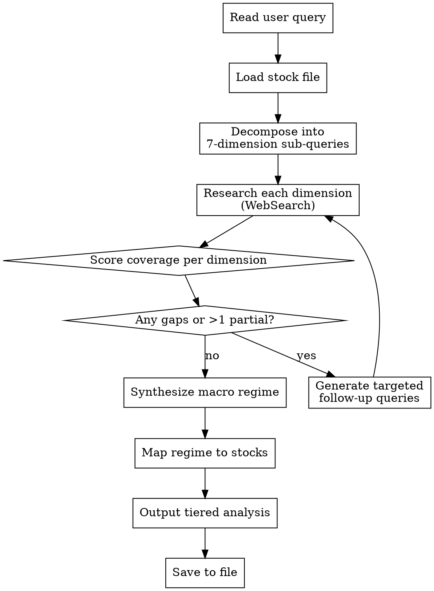

# Macro Research Analyst

Structured methodology for **iterative macroeconomic research** — decomposing broad queries into targeted sub-queries across mandatory dimensions, evaluating coverage gaps, and looping until all dimensions are adequately researched. Then maps the macro regime to the user's actual stocks with tiered position recommendations.

**Goal:** Research like a real macroeconomist — systematic, multi-dimensional, gap-aware — not a shallow one-pass summary.

## When to Use

- User asks for macro analysis, economic outlook, or market regime assessment
- User wants to understand how macro conditions affect specific stocks or sectors
- User asks about Fed policy, inflation, labor market, credit conditions, fiscal policy, or geopolitical risks
- User asks "what should I do with my portfolio given current macro?"
- User provides a broad macro question that needs decomposition

## Workflow



---

## Phase 1: Decompose

### Read the Query

Parse the user's question. Even if narrow ("What does the Fed rate path mean for banks?"), the skill forces research across ALL 7 dimensions — narrow questions get deeper treatment on the focal dimension but never skip the others.

### Load the Stock File

Look for stock/portfolio files in workspace root. Search order:
1. `stocks.md`
2. `portfolio.md`
3. `watchlist.md`

Expected format (simple tickers with sector tags):
```
AAPL: Technology
XOM: Energy
JPM: Financials
LMT: Defense/Aerospace
```

If no file found, ask the user for their tickers before proceeding.

### Generate Sub-Queries

For each of the 7 mandatory dimensions, generate 2-3 targeted search queries. Queries must be **specific and current-dated** — not generic textbook questions.

**Bad:** "What is US monetary policy?"
**Good:** "Federal Reserve interest rate decision April 2026 outlook"
**Good:** "US yield curve 2s10s spread current 2026"

---

## Phase 2: Research — The 7 Mandatory Dimensions

For each dimension, run **2-3 WebSearch calls** with the generated sub-queries. Extract concrete data points, not vague summaries.

### Dimension 1: Monetary Policy
Search targets: Fed funds rate path, dot plot expectations, QT/QE status, balance sheet trajectory, yield curve shape (2s10s, 3m10y), real rates, money supply (M2), bank reserves, overnight repo rates, forward guidance language.

Key question: **Is liquidity expanding or contracting, and at what pace?**

### Dimension 2: Fiscal Policy
Search targets: Federal budget deficit/surplus trajectory, government spending bills (infrastructure, defense, social), tax policy changes (corporate, capital gains, tariff revenue), debt ceiling status, Treasury issuance schedule, state/local fiscal health.

Key question: **Is the government adding or withdrawing stimulus from the economy?**

### Dimension 3: Inflation & Pricing
Search targets: CPI (headline and core), PCE deflator, PPI, wage growth vs productivity, commodity prices (oil, copper, agriculture), housing costs (shelter CPI, rent), inflation expectations (breakevens, Michigan survey), services vs goods inflation.

Key question: **Is inflation accelerating, decelerating, or entrenched — and where in the supply chain?**

### Dimension 4: Labor Market
Search targets: Nonfarm payrolls, unemployment rate (U3, U6), initial/continuing jobless claims, labor force participation, job openings (JOLTS), quits rate, average hourly earnings, unit labor costs, sector-level hiring/firing trends.

Key question: **Is the labor market tightening or loosening, and is wage pressure building or fading?**

### Dimension 5: Growth & Output
Search targets: GDP (latest print + nowcasts like Atlanta Fed GDPNow), ISM Manufacturing/Services PMI, industrial production, retail sales, consumer spending (PCE), business investment (capex, durable goods orders), housing starts, leading economic index (LEI).

Key question: **Is the economy accelerating, decelerating, or in contraction — and is it broad-based or narrow?**

### Dimension 6: Credit Conditions
Search targets: Investment-grade and high-yield credit spreads, Senior Loan Officer Survey (SLOOS), bank lending standards, commercial real estate stress, consumer delinquencies (auto, credit card, mortgage), financial conditions indices (Chicago Fed, Goldman Sachs FCI), corporate default rates.

Key question: **Is credit flowing freely or tightening — and are stress signals emerging anywhere?**

### Dimension 7: Geopolitical & Trade
Search targets: Active tariff regimes and trade policy changes, sanctions (Russia, China, Iran), supply chain disruptions, armed conflicts affecting energy/shipping, trade balance trends, reshoring/friendshoring developments, election/political risk (domestic and key trading partners), OPEC+ decisions.

Key question: **What exogenous shocks or policy shifts could override the domestic macro picture?**

---

## Phase 3: Evaluate Coverage

After each research pass, score every dimension:

| Score | Meaning | Criteria |
|-------|---------|----------|
| **Strong** | Clear picture | 3+ recent data points, direction is unambiguous |
| **Partial** | Incomplete | Some data but missing key indicators, or data is stale (>4 weeks) |
| **Gap** | No useful data | No meaningful recent data points found |

### Coverage Gate

**Do NOT proceed to synthesis until:**
- Zero dimensions scored "Gap"
- At most 1 dimension scored "Partial"

If the gate fails, generate new, more targeted sub-queries for the weak dimensions and loop back to Phase 2. Maximum 3 research iterations to avoid infinite loops — after 3 passes, proceed with whatever coverage exists and flag weak dimensions explicitly.

### Coverage Tracker Format

Print this tracker after each research pass so the user can see progress:

```
Coverage Assessment (Pass N):
  Monetary Policy:     [Strong/Partial/Gap] — key finding summary
  Fiscal Policy:       [Strong/Partial/Gap] — key finding summary
  Inflation & Pricing: [Strong/Partial/Gap] — key finding summary
  Labor Market:        [Strong/Partial/Gap] — key finding summary
  Growth & Output:     [Strong/Partial/Gap] — key finding summary
  Credit Conditions:   [Strong/Partial/Gap] — key finding summary
  Geopolitical & Trade:[Strong/Partial/Gap] — key finding summary

  Gate: [PASS/FAIL — N gaps, M partial]
```

---

## Phase 4: Synthesize Macro Regime

With all dimensions researched, synthesize a **macro regime narrative**. This is the core deliverable — a coherent story about where the economy is in the cycle.

### Regime Classification

Classify the current environment into one of these regimes (or a blend):

| Regime | Characteristics |
|--------|----------------|
| **Goldilocks** | Moderate growth, falling inflation, easy monetary policy, low credit stress |
| **Reflation** | Accelerating growth, rising inflation, stimulative policy (fiscal or monetary) |
| **Stagflation** | Slowing growth, persistent inflation, policy dilemma |
| **Disinflationary boom** | Strong growth, falling inflation (productivity-driven) |
| **Recession/contraction** | Negative growth, rising unemployment, widening credit spreads |
| **Late cycle** | Growth decelerating, tight labor market, tightening credit, flattening/inverted curve |
| **Early recovery** | Growth inflecting positive, easy policy, improving employment, compressed spreads |

### Regime Narrative Structure

1. **Regime label** and confidence level (high / moderate / low)
2. **Dominant macro force** — the single most important dynamic right now
3. **Supporting forces** — what else reinforces the dominant theme
4. **Counter-signals** — what contradicts the regime call (there are always some)
5. **Key inflection risks** — what would change the regime if it happened

---

## Phase 5: Map to Stocks

For each stock in the user's file:

### Step 1: Sector-Macro Sensitivity Matrix

Assess how each of the 7 macro dimensions affects the stock's sector:

```
Stock: [TICKER] — Sector: [SECTOR]
  Monetary Policy:      [Tailwind / Headwind / Neutral] — why
  Fiscal Policy:        [Tailwind / Headwind / Neutral] — why
  Inflation & Pricing:  [Tailwind / Headwind / Neutral] — why
  Labor Market:         [Tailwind / Headwind / Neutral] — why
  Growth & Output:      [Tailwind / Headwind / Neutral] — why
  Credit Conditions:    [Tailwind / Headwind / Neutral] — why
  Geopolitical & Trade: [Tailwind / Headwind / Neutral] — why
```

### Step 2: Net Macro Score + Time Horizon

Tally the tailwinds vs headwinds. Weight dimensions by relevance to the sector (e.g., monetary policy matters more for Financials than for Defense).

| Net Score | Macro Verdict | Meaning |
|-----------|---------------|---------|
| 5+ tailwinds | **Strong Bullish** | Macro environment heavily favors this stock |
| 3-4 tailwinds | **Bullish** | More macro support than headwinds |
| Balanced | **Neutral** | Mixed signals, no clear macro edge |
| 3-4 headwinds | **Bearish** | Macro environment working against this stock |
| 5+ headwinds | **Strong Bearish** | Macro conditions are hostile |

**Time Horizon Assessment** — for each stock, estimate the time horizon over which the macro verdict applies:

| Horizon | When to Apply |
|---------|---------------|
| **Near-term (0-3 months)** | When dominant macro forces are data-driven with imminent catalysts (e.g., next Fed meeting, CPI print, earnings season) |
| **Medium-term (3-12 months)** | When macro trends are established but have a clear trajectory playing out over quarters (e.g., rate cut cycle, fiscal spending ramp) |
| **Structural (1-3 years)** | When macro themes are secular (e.g., reshoring, energy transition, demographic shifts, debt cycle) |

Specify the time horizon per stock and explain what catalyst or condition would either **confirm** or **invalidate** the thesis within that window.

---

## Phase 6: Tiered Output

### Tier 1 (Always shown): Macro Verdict

Present the regime classification, dominant force, and key risks. This is the "executive summary" — the user should understand the macro picture in 60 seconds.

### Tier 2 (Always shown): Stock-Level Direction

For each stock: ticker, sector, net macro verdict (bullish/bearish/neutral), time horizon, and the single most important macro factor driving the call.

Format as a table:

```
| Ticker | Sector | Macro Verdict | Time Horizon | Key Driver |
|--------|--------|---------------|--------------|------------|
| AAPL   | Tech   | Bullish       | Medium-term  | Rate cuts support multiples, strong consumer spend |
| XOM    | Energy | Neutral       | Near-term    | Geopolitical tailwind offset by demand slowdown |
```

### Tier 3 (On request): Sizing & Playbook

Only provide when the user explicitly asks for more detail. Includes:
- Suggested position sizing shifts (overweight / underweight / hold)
- Entry triggers ("add if X happens")
- Risk events with dates ("watch CPI on May 13")
- Hedge suggestions if applicable

---

## Output Persistence

Save the full analysis to `docs/macro-analysis/YYYY-MM-DD-<topic-slug>.md` using the report template in [report-template.md](report-template.md).

If a writable DB MCP is available, also persist the structured data (regime, stock verdicts, scores) there.

---

## Common Mistakes

| Mistake | Fix |
|---------|-----|
| Running one generic search and calling it "macro research" | Skill mandates 7 dimensions × 2-3 queries each. No shortcuts. |
| Skipping coverage evaluation | Print the coverage tracker after EVERY research pass. The gate is mandatory. |
| Stale data presented as current | Every data point must include its date. Flag anything older than 4 weeks. |
| "Bullish on everything" or "bearish on everything" | If all stocks get the same verdict, something is wrong. Re-examine sector-specific sensitivity. |
| Treating all dimensions equally for every sector | Weight dimensions by sector relevance. Rate policy matters more for banks than for defense contractors. |
| Missing time horizon | Every stock verdict MUST include a time horizon. No verdict is valid without a timeframe. |
| Vague regime call with no counter-signals | Always include what contradicts the thesis. Real macro always has tension. |

## Red Flags — STOP and Reassess

- You're about to present a stock verdict without checking all 7 dimensions → go back
- All your searches are generic ("US economy 2026") instead of indicator-specific → rewrite queries
- You haven't printed a coverage tracker → you skipped Phase 3
- Your regime narrative has no counter-signals → add them
- A stock verdict has no time horizon → add it before presenting
