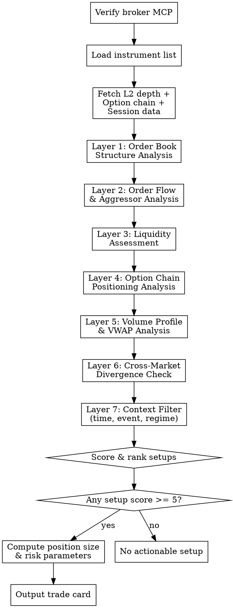

# Market Microstructure Analyst

Structured methodology for **professional intraday trade identification** — consuming Level 2 market depth and option chain data from a broker MCP, computing microstructure signals across 7 analytical layers, scoring trade setups, and outputting actionable trades with precise entry, exit, stop-loss, position sizing, and risk parameters.

**Goal:** Analyze like a professional intraday trader — read the order book for intent, the option chain for positioning, and combine them into high-conviction setups with defined risk. Never trade on vibes. Every trade must have a quantified edge, a defined stop, and a position size derived from risk limits.

**Optimal Timeframe:** Intraday (minutes to hours). This skill is NOT for swing or positional trades.

## When to Use

- User asks for intraday trade ideas or setups
- User asks to analyze order book depth or market depth data
- User asks to read the option chain for directional cues
- User asks "what's the order book telling us about [instrument]?"
- User asks for intraday entries, exits, or stop-loss levels
- User asks about institutional flow, large order detection, or liquidity analysis
- User asks for position sizing for an intraday trade
- User provides live market data and wants real-time interpretation

## Prerequisites

### Broker MCP Connection

This skill requires a connected broker MCP that can provide:
1. **L2 Market Depth** (5-level best bid/ask with quantities and order counts)
2. **Option Chain** (full chain with strikes, LTP, OI, volume, bid/ask, Greeks if available)
3. **Quote / LTP** (last traded price, OHLC, volume for the session)
4. **Historical candles** (1-min or 5-min intraday candles for the current session)

At the start of every invocation, verify the broker MCP is connected by calling its health/test endpoint. If not connected, STOP and tell the user to connect their broker MCP first.

### Supported Broker MCPs

The skill is broker-agnostic. It works with any MCP that provides the data above. Common examples:
- Kite Connect (Zerodha)
- Upstox API
- Dhan API
- Angel One SmartAPI
- IIFL Markets API

### Instrument Configuration

Look for the user's intraday watchlist. Search order:
1. `intraday-watchlist.md`
2. `watchlist.md`
3. Ask the user for instruments

Expected format:
```
NIFTY: Index (Futures + Options)
BANKNIFTY: Index (Futures + Options)
RELIANCE: Equity + Options
HDFCBANK: Equity + Options
```

If the user specifies a single instrument ad-hoc, proceed with just that instrument.

---

## Workflow



---

## Phase 1: Data Acquisition

### Fetch All Data in Parallel

For each instrument in the watchlist, fetch via broker MCP simultaneously:

1. **L2 Market Depth** — 5 best bids and 5 best asks with price, quantity, and number of orders at each level
2. **Option Chain** — for index instruments (NIFTY, BANKNIFTY), fetch the full chain for the nearest weekly expiry. For stock options, fetch the nearest monthly expiry. Need: strike, CE/PE LTP, CE/PE OI, CE/PE volume, CE/PE bid/ask, CE/PE IV, and Greeks (delta, gamma, theta, vega) if available.
3. **Current Quote** — LTP, open, high, low, close (previous), volume, average traded price (ATP), last traded quantity
4. **Intraday Candles** — 5-minute candles for the current session so far (OHLCV)

### Data Validation

Before proceeding, verify:
- Market depth has non-zero quantities on at least 3 bid levels and 3 ask levels (if fewer, the instrument is too illiquid — flag and skip)
- Option chain has at least 5 strikes with non-zero OI on each side of ATM
- Current session has at least 6 candles of data (30+ minutes of trading). If market just opened, warn the user that signals are unreliable in the first 15-20 minutes.

---

## Phase 2: The 7 Analytical Layers

Process each layer sequentially. Each layer produces a directional signal (Bullish / Bearish / Neutral) and a confidence weight (0-2 points). Total maximum score: 14 points across all layers.

### Layer 1: Order Book Structure Analysis

**Input:** L2 market depth (5-level bid/ask)

Compute:
1. **Book Imbalance (Level 1)**
   ```
   L1_imbalance = (Best_Bid_Qty - Best_Ask_Qty) / (Best_Bid_Qty + Best_Ask_Qty)
   ```
   Range: -1.0 to +1.0. Above +0.3 = bullish. Below -0.3 = bearish.

2. **Weighted Book Imbalance (All 5 levels)**
   Weight closer levels more heavily: weights = [5, 4, 3, 2, 1] for levels 1-5.
   ```
   Weighted_Bid = Σ(Bid_Qty[i] × weight[i])
   Weighted_Ask = Σ(Ask_Qty[i] × weight[i])
   WBI = (Weighted_Bid - Weighted_Ask) / (Weighted_Bid + Weighted_Ask)
   ```

3. **Spread Analysis**
   ```
   Spread = Best_Ask - Best_Bid
   Spread_bps = (Spread / Midpoint) × 10000
   ```
   For NIFTY futures: normal spread < 0.5 points. For stocks: compare to typical spread.
   Widening spread = uncertainty. Narrowing spread = conviction forming.

4. **Order Clustering**
   Identify if any single level has quantity > 3× the average level quantity — this is a **wall**.
   - Bid wall = potential support (but may be spoofing)
   - Ask wall = potential resistance (but may be spoofing)
   Note the price level and quantity of any walls.

5. **Order Count Analysis**
   Compare number of orders vs. total quantity per level:
   - Large quantity ÷ few orders = institutional order (more reliable)
   - Large quantity ÷ many orders = crowd (less reliable, can scatter)

**Layer 1 Signal:**
| Condition | Signal | Points |
|-----------|--------|--------|
| WBI > +0.4 AND L1_imbalance > +0.3 AND no large ask wall near best ask | **Bullish** | 2 |
| WBI > +0.2 OR L1_imbalance > +0.3 | **Lean Bullish** | 1 |
| WBI between -0.2 and +0.2 | **Neutral** | 0 |
| WBI < -0.2 OR L1_imbalance < -0.3 | **Lean Bearish** | -1 |
| WBI < -0.4 AND L1_imbalance < -0.3 AND no large bid wall near best bid | **Bearish** | -2 |

### Layer 2: Order Flow & Aggressor Analysis

**Input:** Current session's trades data (or inferred from candle data + volume)

If the broker MCP provides trade-by-trade data with aggressor tagging:
1. **Cumulative Delta** — running sum of (volume at ask - volume at bid) for the session
2. **Delta Trend** — is cumulative delta rising, falling, or flat over the last 30 minutes?
3. **Delta-Price Divergence** — price making new highs but delta flat/falling = exhaustion. Price flat but delta surging = absorption/accumulation.

If trade-level data is NOT available (most broker MCPs don't provide this), infer from candle data:
1. **Candle-Level Delta Proxy** — for each 5-min candle:
   - If close > open: assign +volume (buyers dominated)
   - If close < open: assign -volume (sellers dominated)
   - If close ≈ open (doji): assign 0
2. **Cumulative proxy delta** — running sum of the above
3. **Volume-price confirmation** — up candles on above-average volume = buying conviction. Down candles on above-average volume = selling conviction.

**Layer 2 Signal:**
| Condition | Signal | Points |
|-----------|--------|--------|
| Cumulative delta rising + price rising (trend confirmation) | **Bullish** | 2 |
| Cumulative delta rising + price flat (accumulation) | **Lean Bullish** | 1 |
| No clear delta trend | **Neutral** | 0 |
| Cumulative delta falling + price flat (distribution) | **Lean Bearish** | -1 |
| Cumulative delta falling + price falling (trend confirmation down) | **Bearish** | -2 |

**Special divergence signals (override normal scoring):**
- Price at session high BUT delta declining → **Bearish divergence** → -2 points regardless
- Price at session low BUT delta rising → **Bullish divergence** → +2 points regardless

### Layer 3: Liquidity Assessment

**Input:** L2 depth + session volume data

1. **Total Visible Depth**
   ```
   Total_Bid_Depth = Σ(Bid_Qty across all 5 levels)
   Total_Ask_Depth = Σ(Ask_Qty across all 5 levels)
   ```

2. **Depth Ratio**
   ```
   Depth_Ratio = Total_Bid_Depth / Total_Ask_Depth
   ```
   \> 1.5 = significantly more buy support. < 0.67 = significantly more sell pressure.

3. **Session Volume vs. Average**
   ```
   RVOL = Current_Session_Volume / Expected_Volume_at_This_Time
   ```
   Use the instrument's average daily volume, pro-rated by time of day (roughly: first hour = 30% of daily volume, midday hours = 10% each, last hour = 25%).
   - RVOL > 1.5 = elevated activity, signals are stronger
   - RVOL < 0.7 = low activity, signals are weaker and unreliable

4. **Liquidity Sufficiency Check**
   For the intended trade size, how many levels of the order book would you consume?
   If the answer is > 2 levels, the instrument is too illiquid for the intended size — reduce size or skip.

**Layer 3 Signal:**
| Condition | Signal | Points |
|-----------|--------|--------|
| Depth ratio > 1.5 AND RVOL > 1.2 | **Bullish** (strong buy support on active day) | 2 |
| Depth ratio > 1.3 OR (Depth ratio > 1.0 AND RVOL > 1.5) | **Lean Bullish** | 1 |
| Depth ratio between 0.75 and 1.3 | **Neutral** | 0 |
| Depth ratio < 0.75 OR (Depth ratio < 1.0 AND RVOL > 1.5) | **Lean Bearish** | -1 |
| Depth ratio < 0.67 AND RVOL > 1.2 | **Bearish** (strong sell pressure on active day) | -2 |

**If RVOL < 0.7: Cap ALL layer scores at ±1 maximum. Low-volume signals are unreliable.**

### Layer 4: Option Chain Positioning Analysis

**Input:** Full option chain for nearest expiry

This is the most information-rich layer for index trading. The option chain reveals how large participants are positioned.

1. **Put-Call Ratio (OI-based)**
   ```
   PCR_OI = Total_Put_OI / Total_Call_OI
   ```
   - PCR > 1.2 = more puts written → market participants are net bullish (put writers expect support)
   - PCR < 0.8 = more calls written → market participants are net bearish (call writers expect resistance)
   - PCR between 0.8-1.2 = balanced

2. **Max Pain**
   Calculate the strike at which the total value of OI (calls + puts) would be minimized if the underlying expired there. Price tends to gravitate toward max pain near expiry.
   ```
   For each strike K:
     Call_pain = Σ(Call_OI[k] × max(0, K - k)) for all strikes k < K
     Put_pain = Σ(Put_OI[k] × max(0, k - K)) for all strikes k > K
     Total_pain[K] = Call_pain + Put_pain
   Max_Pain = strike K with minimum Total_pain
   ```

3. **OI Concentration — Support & Resistance**
   - **Highest Put OI strike** = institutional support level (put writers defend this level)
   - **Highest Call OI strike** = institutional resistance level (call writers defend this level)
   - These form the expected range for the session/expiry.

4. **OI Change Analysis (if available)**
   - Strikes with highest OI buildup today reveal where fresh positioning is happening
   - Call OI buildup at a strike = resistance being reinforced
   - Put OI buildup at a strike = support being reinforced
   - OI unwinding at a strike = that level is being abandoned

5. **IV Skew**
   Compare implied volatility of OTM puts vs. OTM calls:
   - If OTM put IV >> OTM call IV = market is hedging downside (fear)
   - If OTM call IV >> OTM put IV = market is pricing upside (rare, usually squeeze setups)
   - Symmetric IV = balanced expectations

6. **Immediate ATM Analysis**
   For the strikes immediately around current price:
   - ATM straddle price = market's expected move for the expiry
   - ATM IV level vs. recent average = is volatility elevated or depressed?

**Layer 4 Signal:**
| Condition | Signal | Points |
|-----------|--------|--------|
| PCR > 1.2 AND price above max pain AND price below highest call OI | **Bullish** (supported, room to rise) | 2 |
| PCR > 1.0 AND price near strong put OI support | **Lean Bullish** | 1 |
| Price between max pain ± 0.5% AND PCR balanced | **Neutral** (range-bound) | 0 |
| PCR < 0.8 AND price below max pain AND price above highest put OI | **Lean Bearish** | -1 |
| PCR < 0.8 AND price approaching/breaching highest put OI level | **Bearish** (support cracking, cascade risk) | -2 |

**Special option signals:**
- Price breaks above the highest call OI strike with rising volume → **short covering rally** → strong bullish momentum, add +1 bonus point
- Price breaks below the highest put OI strike with rising volume → **put unwinding cascade** → strong bearish momentum, add -1 bonus point

### Layer 5: Volume Profile & VWAP Analysis

**Input:** Intraday candles (5-min OHLCV)

1. **VWAP Calculation**
   ```
   VWAP = Σ(Typical_Price × Volume) / Σ(Volume)
   where Typical_Price = (High + Low + Close) / 3
   ```
   VWAP is the institutional benchmark. Institutions buy below VWAP and sell above VWAP.

2. **Price vs. VWAP**
   - Price consistently above VWAP = buyers in control, institutional demand
   - Price consistently below VWAP = sellers in control, institutional supply
   - Price oscillating around VWAP = no dominant player, range day

3. **VWAP Slope**
   Is VWAP trending up, down, or flat?
   - Rising VWAP = average entry price for the day is rising = buyers dominant
   - Falling VWAP = sellers dominant
   - Flat VWAP = balanced

4. **Volume-Price Nodes** (simplified volume profile)
   Group the session's candles into price buckets (e.g., every 10 points for NIFTY, every ₹5 for stocks). Sum volume in each bucket.
   - **High Volume Node (HVN)** = price level where most trading occurred = fair value, acts as magnet
   - **Low Volume Node (LVN)** = price level with minimal trading = rejection area, price moves quickly through these

5. **ATP (Average Traded Price) vs. LTP**
   Most broker MCPs provide ATP directly.
   - LTP > ATP = current buyers are paying above average — bullish momentum
   - LTP < ATP = current price below average — selling pressure or mean reversion trade opportunity

**Layer 5 Signal:**
| Condition | Signal | Points |
|-----------|--------|--------|
| Price > VWAP AND VWAP rising AND LTP > ATP | **Bullish** | 2 |
| Price > VWAP OR (price near VWAP AND VWAP rising) | **Lean Bullish** | 1 |
| Price ≈ VWAP (within 0.1%) AND VWAP flat | **Neutral** | 0 |
| Price < VWAP OR (price near VWAP AND VWAP falling) | **Lean Bearish** | -1 |
| Price < VWAP AND VWAP falling AND LTP < ATP | **Bearish** | -2 |

### Layer 6: Cross-Market Divergence Check

**Input:** Quotes/candles for related instruments

For **NIFTY**: Check BANKNIFTY, NIFTY IT, NIFTY FIN — are sector indices confirming or diverging?
For **BANKNIFTY**: Check HDFCBANK, ICICIBANK, KOTAKBANK, SBIN — are heavyweights aligned?
For **Individual stocks**: Check the sector index and NIFTY — is the stock stronger or weaker than its sector?

1. **Relative Strength (Intraday)**
   ```
   RS = Stock_%_change_today / Index_%_change_today
   ```
   - RS > 1.2 = stock is outperforming (stronger than market)
   - RS < 0.8 = stock is underperforming (weaker than market)

2. **Sector-Index Divergence**
   - If NIFTY is green but BANKNIFTY is red (or vice versa) = rotation, not broad move. Trade the stronger one.
   - If all indices are aligned = broad directional day. Higher conviction for directional trades.

3. **Futures Premium / Discount** (for index)
   ```
   Futures_Premium = (Futures_LTP - Spot_LTP) / Spot_LTP × 100
   ```
   Healthy premium (0.05-0.15%) = normal carry. Shrinking/negative premium = bearish undertone. Expanding premium = bullish undertone.

**Layer 6 Signal:**
| Condition | Signal | Points |
|-----------|--------|--------|
| All related instruments confirming direction + futures premium healthy/expanding | **Confirming** | 2 |
| Most instruments aligned, minor divergence | **Mostly confirming** | 1 |
| Mixed signals across related instruments | **Divergent** | 0 |
| Most instruments diverging from the setup direction | **Warning** | -1 |
| Strong divergence — setup direction contradicted by broader market | **Contradicting** | -2 |

### Layer 7: Context Filter (Time, Event, Regime)

**Input:** Current time, event calendar, recent session behavior

1. **Time-of-Day Filter**
   | Time Window | Characteristic | Signal Reliability |
   |-------------|---------------|-------------------|
   | 9:15-9:30 | Opening volatility, gap reactions | LOW — avoid new entries, let the noise settle |
   | 9:30-10:30 | First hour trend establishment | HIGH — strongest trends start here |
   | 10:30-13:00 | Midday range / consolidation | MODERATE — mean reversion setups work better |
   | 13:00-14:00 | Post-lunch drift, often low volume | LOW — reduce conviction |
   | 14:00-14:30 | Institutional re-entry, European open influence | MODERATE-HIGH — new directional moves start |
   | 14:30-15:15 | Last hour acceleration | HIGH — follow the direction, don't fight it |
   | 15:15-15:30 | Closing auction, squaring off | LOW — close positions, don't enter new ones |

2. **Event Filter**
   Check (via WebSearch if needed) if today has:
   - RBI policy announcement → widen stops 2×, reduce size 50%, or sit out
   - Weekly options expiry (Thursday) → max pain and OI analysis gets highest weight
   - Monthly F&O expiry → expect high volatility, wider stops needed
   - US market event tonight (Fed, CPI, NFP) → Indian market may be cautious / range-bound ahead of it
   - Major earnings (HDFC Bank, Reliance, TCS) → that stock's microstructure is unreliable pre-announcement

3. **Session Regime** (computed from today's candle data)
   | Pattern | Regime | Trading Approach |
   |---------|--------|-----------------|
   | Price making higher highs and higher lows | **Trending Up** | Buy dips to VWAP, don't short |
   | Price making lower highs and lower lows | **Trending Down** | Sell rallies to VWAP, don't buy |
   | Price oscillating in a range (ATR contracting) | **Range-Bound** | Fade extremes, trade toward VWAP |
   | Large candles, wide range, high RVOL | **Volatile/Event** | Reduce size, widen stops, be selective |
   | No clear pattern, low volume | **Dead/Drift** | Don't trade. Sit out. |

**Layer 7 Signal:**
Apply as a multiplier to total score:
- HIGH reliability window + clear session regime → Multiplier: 1.0 (full weight)
- MODERATE reliability window → Multiplier: 0.75
- LOW reliability window → Multiplier: 0.5 (halve the score)
- Event day with pre-event uncertainty → Multiplier: 0.5
- Dead/Drift regime → Multiplier: 0.0 (no trade regardless of score)

---

## Phase 3: Score & Rank Setups

### Compute Total Score

For each instrument:
```
Raw_Score = Layer1_pts + Layer2_pts + Layer3_pts + Layer4_pts + Layer5_pts + Layer6_pts
Adjusted_Score = Raw_Score × Layer7_multiplier
```

Raw score range: -12 to +12
Adjusted score range: -12 to +12

### Interpretation

| Adjusted Score | Interpretation | Action |
|---------------|----------------|--------|
| +8 to +12 | **Strong Bullish Setup** | High conviction long. Full size. |
| +5 to +7 | **Bullish Setup** | Moderate conviction long. 60-75% size. |
| +3 to +4 | **Lean Bullish** | Weak setup. Only trade if other edge exists (e.g., technical support confluence). 40-50% size. |
| -2 to +2 | **No Setup** | No actionable signal. DO NOT TRADE. |
| -4 to -3 | **Lean Bearish** | Weak short setup. Small size if at all. |
| -7 to -5 | **Bearish Setup** | Moderate conviction short. 60-75% size. |
| -12 to -8 | **Strong Bearish Setup** | High conviction short. Full size. |

### Minimum Score Gate

**Do NOT output a trade recommendation if |Adjusted_Score| < 5.** Below this threshold, tell the user "No actionable setup at this time" and show the layer breakdown so they understand why.

---

## Phase 4: Risk Management & Position Sizing

### Step 1: Define Maximum Risk Per Trade

Load risk parameters from `risk-config.md` in workspace root. If not found, use defaults:

```
Default Risk Parameters:
  Max risk per trade:     1.0% of trading capital
  Max daily loss:         3.0% of trading capital
  Max concurrent trades:  3
  Trading capital:        [ASK USER — never assume]
```

If the user hasn't specified trading capital, ASK before computing position size. Never assume a capital amount.

### Step 2: Compute Stop-Loss

The stop-loss is derived from microstructure, not from arbitrary percentages:

**For Bullish trades:**
- Primary stop: Below the strongest bid wall identified in Layer 1 (if clear wall exists)
- Secondary stop: Below session low or nearest HVN below entry
- Fallback stop: Below VWAP (if price is above VWAP)
- Maximum stop distance: 1.5× the instrument's average 5-min ATR for the session

**For Bearish trades:**
- Primary stop: Above the strongest ask wall identified in Layer 1
- Secondary stop: Above session high or nearest HVN above entry
- Fallback stop: Above VWAP (if price is below VWAP)
- Maximum stop distance: 1.5× the instrument's average 5-min ATR for the session

```
Stop_Distance = |Entry_Price - Stop_Loss_Price|
```

If the nearest logical stop-loss requires a stop distance > 2× the average 5-min ATR, the trade is **too risky for the available structure** — skip it or reduce to minimum size.

### Step 3: Compute Position Size

```
Risk_Amount = Trading_Capital × Max_Risk_Per_Trade_%
Position_Size = Risk_Amount / Stop_Distance
```

For options:
```
Position_Size_Lots = floor(Risk_Amount / (Stop_Distance_Points × Lot_Size))
```

**Hard caps:**
- Never exceed 10% of trading capital in a single position (notional)
- For options, never risk more than 1.5% of capital on premium (options can go to zero)
- If the computed size would consume > 2 levels of the order book depth → reduce to 50% of depth at best bid/ask

### Step 4: Define Target

Targets are derived from microstructure:
- **Primary target:** Nearest significant ask wall (for longs) or bid wall (for shorts) from Layer 1
- **Secondary target:** Highest call OI strike (for index longs) or highest put OI strike (for shorts) from Layer 4
- **Conservative target:** VWAP (if entering on a pullback)

```
Reward_Risk_Ratio = |Target - Entry| / |Entry - Stop_Loss|
```

**Minimum R:R gate: Do NOT recommend a trade with R:R < 1.5:1.** If the nearest logical target doesn't give 1.5:1, skip the trade.

### Step 5: Trail Stop Rules

Once the trade is in profit:
- At 1R profit → move stop to breakeven
- At 2R profit → trail stop to 1R
- If the price creates a new HVN between entry and target → consider partial exit (50%)

---

## Phase 5: Output — The Trade Card

### When a Trade Setup Exists (|Score| >= 5)

Output a structured trade card:

```
═══════════════════════════════════════════════════
  TRADE CARD — [INSTRUMENT]
  Generated: [Date] [Time]
  Session: [Pre-market / First Hour / Midday / Last Hour]
═══════════════════════════════════════════════════

  Direction:    [LONG / SHORT]
  Conviction:   [Strong / Moderate] (Adjusted Score: X)
  Instrument:   [e.g., NIFTY 22500 CE (weekly) or RELIANCE EQ]

  Entry:        ₹[Price] (current LTP: ₹[LTP])
  Stop-Loss:    ₹[Price] ([X] points / [Y]% from entry)
  Target 1:     ₹[Price] ([X] points / R:R = [Y]:1)
  Target 2:     ₹[Price] ([X] points / R:R = [Y]:1) [if applicable]
  Trail:        Move SL to breakeven at ₹[price] (1R achieved)

  Position Size: [X] shares/lots
  Risk Amount:   ₹[Amount] ([Y]% of capital)
  Notional:      ₹[Amount] ([Y]% of capital)

───────────────────────────────────────────────────
  LAYER BREAKDOWN
───────────────────────────────────────────────────
  L1 Order Book Structure:    [Signal] [Points]  — [one-line reason]
  L2 Order Flow / Delta:      [Signal] [Points]  — [one-line reason]
  L3 Liquidity:               [Signal] [Points]  — [one-line reason]
  L4 Option Chain:            [Signal] [Points]  — [one-line reason]
  L5 VWAP / Volume Profile:   [Signal] [Points]  — [one-line reason]
  L6 Cross-Market:            [Signal] [Points]  — [one-line reason]
  L7 Context Multiplier:      [×Mult]            — [time window + regime]
                              ─────────
  Raw Score:                  [X] / 12
  Adjusted Score:             [X]

───────────────────────────────────────────────────
  KEY LEVELS
───────────────────────────────────────────────────
  Session High:     ₹[Price]
  Session Low:      ₹[Price]
  VWAP:             ₹[Price]
  Max Pain:         [Strike] (options)
  Highest Call OI:  [Strike] @ [OI] (resistance)
  Highest Put OI:   [Strike] @ [OI] (support)
  Bid Wall:         ₹[Price] — [Qty] shares/contracts
  Ask Wall:         ₹[Price] — [Qty] shares/contracts

───────────────────────────────────────────────────
  INVALIDATION
───────────────────────────────────────────────────
  This trade is INVALID if:
  - [Specific condition that breaks the thesis]
  - [e.g., "Price closes below VWAP on rising volume"]
  - [e.g., "Put OI at 22400 gets unwound > 30%"]

═══════════════════════════════════════════════════
```

### When No Setup Exists (|Score| < 5)

```
═══════════════════════════════════════════════════
  NO ACTIONABLE SETUP — [INSTRUMENT]
  [Date] [Time]
═══════════════════════════════════════════════════

  Adjusted Score: [X] (threshold: ±5)
  Regime: [Trending / Range / Drift / Volatile]
  Reason: [One sentence — e.g., "Order book is balanced,
           option chain is neutral, low RVOL — no edge."]

  Layer Summary:
  L1: [pts]  L2: [pts]  L3: [pts]  L4: [pts]
  L5: [pts]  L6: [pts]  L7: [×mult]

  Watch for:
  - [What would create a setup — e.g., "Bullish setup if
     price breaks above 22500 with OI support shift"]
═══════════════════════════════════════════════════
```

---

## Intraday Risk Rules — HARD CONSTRAINTS

These rules are non-negotiable. They override any layer signal.

| Rule | Enforcement |
|------|-------------|
| **Max 1% risk per trade** | Position size formula enforces this. Never override. |
| **Max 3% daily loss** | If cumulative realized + unrealized losses for the day reach 3% → STOP TRADING. Tell the user the daily loss limit is hit. |
| **Max 3 concurrent positions** | Do not recommend a 4th position until one is closed. |
| **No trades in first 5 minutes** | Opening 9:15-9:20 is pure noise. Never recommend entries here. |
| **No new trades after 15:10** | Last 20 minutes are for closing, not opening. |
| **R:R minimum 1.5:1** | No trade below this. A 1:1 setup is not worth the execution cost and slippage. |
| **All positions flat by 15:20** | Intraday means intraday. Recommend closing all positions by 15:20. No overnight carries unless user explicitly requests. |
| **RVOL < 0.5 = no trade** | Illiquid sessions produce unreliable signals. Sit out. |
| **Expiry day sizing = 50%** | On weekly/monthly expiry days, reduce all position sizes by 50%. Gamma risk is elevated. |

---

## Refresh Protocol

Microstructure data is perishable. A snapshot is useful for about 2-5 minutes for the order book and 15-30 minutes for option chain OI.

- **If the user asks for a trade**: Fetch fresh data, run all 7 layers, produce a trade card. Every invocation starts from fresh data.
- **If the user asks to "monitor" or "watch"**: Fetch data every 5 minutes (or on user request), re-score, and notify if the score crosses the ±5 threshold in either direction or if an existing trade's stop/target has been hit.
- **If the user asks to "evaluate" an existing position**: Fetch fresh data, re-run layers, and assess if the original thesis still holds. If the score has flipped sign or dropped below ±3, recommend exiting.

---

## Common Mistakes

| Mistake | Fix |
|---------|-----|
| Using stale data (fetched > 5 minutes ago for order book) | Always fetch fresh data at the start of every analysis |
| Ignoring time-of-day context | Layer 7 multiplier is mandatory. A perfect setup at 12:30 PM is worth less than a decent setup at 9:45 AM |
| Trading without a stop-loss | Every trade card MUST have a stop. If you can't identify a logical stop, there's no trade. |
| Over-sizing on "conviction" | Conviction determines SIZE within the risk limit, not whether to bypass the risk limit. 1% max per trade always holds. |
| Treating option chain as infallible | OI data is end-of-day precise; intraday OI is estimated. OI can be wrong near expiry. Use it as one layer, not the only layer. |
| Recommending trades in Dead/Drift regime | Layer 7 multiplier goes to 0 in drift. Respect it. No trading on dead days. |
| Ignoring cross-market divergence | If NIFTY and BANKNIFTY are giving opposite signals, something is wrong. Reduce conviction. |
| Not validating data before analysis | Always run the data validation step. Garbage in, garbage out. |

## Red Flags — STOP and Reassess

- You're about to recommend a trade without computing position size → go back
- The trade has no stop-loss → do not output it
- R:R is below 1.5:1 → skip the trade
- RVOL is below 0.5 and you're still recommending a trade → cancel it
- You're recommending a 4th concurrent position → check if one can be closed first
- It's after 15:10 and you're recommending a new entry → don't
- The adjusted score is between -4 and +4 → there is no trade, say so clearly
- Daily loss exceeds 3% → tell the user to stop for the day
