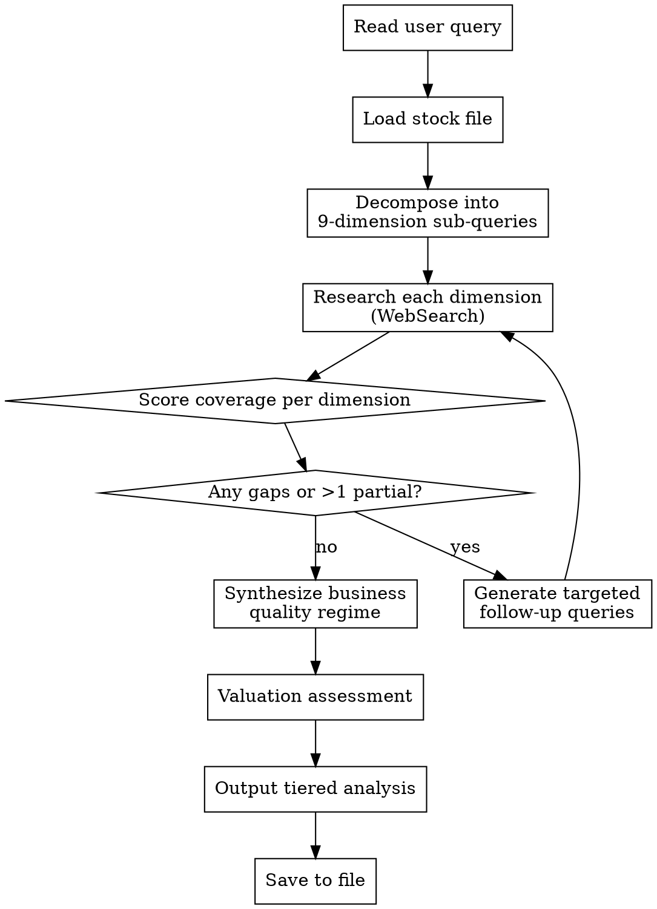

# Micro Research Analyst

Structured methodology for **iterative microeconomic research** — decomposing company analysis into 9 mandatory firm-level and industry-level dimensions, evaluating coverage gaps, and looping until all dimensions are adequately researched. Then synthesizes a business quality regime and maps it to a valuation verdict with tiered position recommendations.

**Goal:** Analyze like a real fundamental analyst — systematic, multi-dimensional, gap-aware — not a shallow one-pass summary. Every stock verdict must be grounded in concrete microeconomic evidence, not narrative hand-waving.

**Optimal Timeframe:** Position trading (1-6 months) and investment (6 months-3 years). Supplementary for swing trading (catalyst selection and earnings positioning).

## When to Use

- User asks for fundamental analysis of a specific company or set of companies
- User asks about competitive moats, pricing power, unit economics, or business quality
- User wants to know if a stock is a compounder, value trap, turnaround, or cash cow
- User asks "is this a good business?" or "should I hold this long-term?"
- User asks about industry structure, competitive dynamics, or market share trends
- User asks to evaluate management quality or capital allocation track record
- User asks about disruption risk, regulatory exposure, or supply chain dependencies
- User provides earnings results and wants a fundamental interpretation beyond the headline numbers

## Workflow



---

## Phase 1: Decompose

### Read the Query

Parse the user's question. Even if narrow ("Does Titan have pricing power?"), the skill forces research across ALL 9 dimensions — narrow questions get deeper treatment on the focal dimension but never skip the others. A company's micro picture is interconnected; you cannot evaluate pricing power without understanding industry structure, or capital allocation without understanding unit economics.

### Load the Stock File

Look for stock/portfolio files in workspace root. Search order:
1. `stocks.md`
2. `portfolio.md`
3. `watchlist.md`

Expected format (simple tickers with sector tags):
```
RELIANCE: Energy/Conglomerate
HDFCBANK: Financials
TCS: IT Services
TITAN: Consumer Discretionary
ASIANPAINT: Consumer Staples/Building Materials
```

If no file found, ask the user for their tickers before proceeding. If the user provides a single stock ad-hoc, proceed with just that stock.

### Generate Sub-Queries

For each of the 9 mandatory dimensions, generate 2-3 targeted search queries. Queries must be **specific, company-named, and current-dated** — not generic textbook questions.

**Bad:** "What is the competitive advantage of Indian IT companies?"
**Good:** "TCS market share in IT services 2025 2026 vs Infosys Accenture"
**Good:** "TCS revenue per employee trend FY24 FY25 operating leverage"
**Good:** "TCS client concentration top 10 customers percentage revenue"

---

## Phase 2: Research — The 9 Mandatory Dimensions

For each dimension, run **2-3 WebSearch calls** with the generated sub-queries. Extract concrete data points with dates — not vague summaries. Every claim must have a number or a verifiable fact behind it.

### Dimension 1: Industry Structure & Competitive Landscape

Search targets: Market structure type (oligopoly, fragmented, duopoly), market size and growth rate, market share of top 3-5 players (with specific percentages), Herfindahl-Hirschman Index if available, barriers to entry (capital intensity, regulation, network effects, IP, brand), barriers to exit, recent entrants or exits in the last 2-3 years, industry consolidation trends, industry-level profitability (average ROIC, average margins).

Key question: **Is this a structurally attractive industry where participants can earn sustained economic profits, or is it a competitive grinder where returns revert to cost of capital?**

Sector-specific focus:
- For **Financials**: NIM spread trends across industry, regulatory capital requirements, license moats
- For **Technology/IT**: Platform vs. services distinction, winner-take-all dynamics, TAM penetration
- For **Consumer**: Brand fragmentation vs. consolidation, private label threat, distribution barriers
- For **Industrials/Materials**: Capacity cycle position, commodity vs. specialty split, import competition

### Dimension 2: Competitive Moat & Durable Advantages

Search targets: Switching costs (quantified — what does it cost a customer to leave?), network effects (one-sided, two-sided, data network effects — with user/node counts), intangible assets (brand value rankings, patent portfolio size and expiry schedule, licenses, regulatory capture), cost advantages (scale curve position, proprietary process, location, resource access), efficient scale (is the addressable market only big enough for N profitable players?), counter-positioning vs. incumbents (does the company's business model impose a lose-lose on competitors who try to copy it?).

Key question: **Does this company have structural advantages that competitors cannot replicate within 5+ years, and are those advantages widening or narrowing?**

Moat trajectory is more important than moat existence:
- **Widening moat**: Network effects compounding, switching costs increasing, scale advantage growing
- **Stable moat**: Advantages holding but not growing — industry dynamics unchanged
- **Narrowing moat**: New entrants eroding share, technology disrupting the cost advantage, regulation removing barriers

### Dimension 3: Pricing Power & Elasticity

Search targets: Historical price increases vs. volume impact (last 3-5 years), gross margin trends over 5+ years, ability to pass through input cost inflation (specific episodes — "when crude rose 40% in 2022, did the company maintain margins?"), contract structures (long-term vs. spot, take-or-pay, cost-escalation clauses), customer concentration risk (top 10 customers as % of revenue), evidence of price discrimination or tiered pricing, ASP (average selling price) trends vs. industry peers, revenue growth decomposition (price vs. volume vs. mix).

Key question: **Can this company raise prices without losing meaningful volume — and has it demonstrated this repeatedly through different economic environments?**

Evidence hierarchy (strongest to weakest):
1. **Demonstrated**: Company raised prices X% and volume held or grew — with specific dates
2. **Structural**: Contract terms, switching costs, or regulatory protection that imply pricing power
3. **Inferred**: Stable/expanding gross margins through inflationary periods
4. **Claimed**: Management says they have pricing power but no supporting data

### Dimension 4: Unit Economics & Cost Structure

Search targets: Gross margin (5-year trend), contribution margin by segment if multi-segment, fixed vs. variable cost split (estimate from cost structure disclosures), operating leverage (how fast does EBIT grow per unit of revenue growth — calculate the degree of operating leverage), marginal cost trends, economies of scale evidence (revenue growing faster than costs), SG&A as % of revenue trend, R&D intensity (R&D/revenue) and R&D productivity (revenue per R&D rupee spent, or patents per R&D spend), capex intensity (capex/revenue, capex/depreciation — above 1.0 means the asset base is growing), maintenance capex vs. growth capex split, CAC vs. LTV for subscription/platform businesses, contribution per unit if available.

Key question: **Does each incremental unit of revenue generate more profit than the last, and is the cost structure improving or deteriorating structurally?**

Red flags to surface:
- Revenue growing but margins flat or declining = no operating leverage = bad unit economics
- Capex/depreciation consistently > 2.0 = asset-heavy treadmill
- SG&A growing faster than revenue = scaling problem
- R&D intensity declining while competitors increase = underinvestment risk

### Dimension 5: Supply Chain & Input Dependencies

Search targets: Key raw material/input costs and their trends (name specific commodities — crude, palm oil, TiO2, lithium, etc.), supplier concentration (single-source risk, top 3 suppliers as % of procurement), vertical integration strategy (does the company own upstream/downstream?), inventory management (days inventory outstanding trend — rising DIO = demand problem or hoarding), supply chain geographic concentration (China dependency, single-factory risk), logistics cost as % of revenue, commodity hedging strategy and effectiveness, procurement advantages (long-term contracts, captive sourcing, location-based cost).

Key question: **How exposed is this company to input cost shocks or supply disruptions, and does it have structural procurement advantages that peers lack?**

### Dimension 6: Demand Drivers & Customer Analysis

Search targets: Total addressable market (TAM) and growth rate (cite the source — company estimate vs. independent research), SAM/SOM breakdown if available, customer segmentation (enterprise vs. SMB vs. consumer, domestic vs. export), customer concentration (top customer and top 10 customers as % of revenue — NAME the customers if public), customer acquisition trends and churn/retention rates, secular demand drivers (demographic shifts, technology adoption curves, regulatory mandates), cyclicality of demand (correlation to GDP, discretionary vs. non-discretionary), order backlog or book-to-bill ratio, same-store sales or organic growth decomposition (price vs. volume vs. mix vs. new customers), net revenue retention rate for SaaS/subscription businesses.

Key question: **Is underlying demand growing securely, diversified across customers, and driven by structural rather than cyclical forces?**

### Dimension 7: Capital Allocation & Management Quality

Search targets: ROIC vs. WACC (over 5-10 years — is the company creating or destroying value?), historical M&A track record (list acquisitions, their size, and whether they generated returns above cost of capital), share buyback effectiveness (did management buy back shares below intrinsic value or at peaks?), dividend policy and payout ratio trend, insider ownership (promoter holding % and whether it's rising or falling), institutional ownership changes (FII/DII trends), management tenure and background, management compensation structure (fixed vs. variable, ESOP dilution, performance metrics), capital deployment priorities stated vs. actual, debt management and leverage philosophy (net debt/EBITDA trend, interest coverage), related-party transactions and governance red flags.

Key question: **Does management consistently deploy capital at returns above cost of capital, and are their incentives aligned with long-term minority shareholders?**

Governance red flags to surface:
- Promoter pledge > 20% of holdings
- Related-party transactions growing faster than revenue
- Frequent equity dilution (QIPs, preferential allotments) without corresponding ROIC improvement
- Auditor changes or qualifications
- Management guidance consistently missed by >15%

### Dimension 8: Regulatory & Disruption Risk

Search targets: Current and pending regulatory changes affecting the industry (name specific regulations), antitrust exposure (CCI investigations, market dominance concerns), ESG/environmental regulatory costs (carbon tax exposure, emission compliance costs), subsidy or tax credit dependencies (PLI scheme benefits, SEZ advantages — and their expiry dates), technological disruption threats (what technology could make this business model obsolete in 5-10 years?), substitute products emerging or gaining share, patent cliffs or IP expirations, political/social risk to the business model (e.g., sin taxes for alcohol/tobacco, data privacy regulation for tech), litigation exposure (pending cases, contingent liabilities).

Key question: **What could structurally impair this business from outside — regulation, technology, or substitution — and how resilient is the company if it happens?**

### Dimension 9: Valuation & Market Expectations

Search targets: Current P/E (trailing and forward), EV/EBITDA, P/FCF, PEG ratio — each compared to 5-year average AND peer group median, implied growth rate embedded in current price (reverse DCF — what growth does the current price assume?), FCF yield (inverse of P/FCF), earnings revision trends over last 90 days (upward or downward, and magnitude), consensus estimates vs. company guidance, short interest or short-selling activity, institutional ownership changes (bulk deals, block deals in last 90 days), promoter buying/selling, PB vs. ROE plot (is the premium justified by returns?).

Key question: **What growth and profitability is the market currently pricing in, and is that expectation reasonable, optimistic, or pessimistic relative to the fundamental picture from dimensions 1-8?**

Valuation traps to flag:
- Low P/E + declining ROIC = value trap, not value
- High P/E + accelerating ROIC + expanding moat = potentially justified premium
- Price near all-time high + earnings revisions turning negative = consensus about to crack
- Price beaten down + insider buying + earnings revisions stabilizing = potential turnaround entry

---

## Phase 3: Evaluate Coverage

After each research pass, score every dimension:

| Score | Meaning | Criteria |
|-------|---------|----------|
| **Strong** | Clear picture | 3+ recent data points, direction is unambiguous |
| **Partial** | Incomplete | Some data but missing key indicators, or data is stale (>2 quarters) |
| **Gap** | No useful data | No meaningful recent data points found |

### Coverage Gate

**Do NOT proceed to synthesis until:**
- Zero dimensions scored "Gap"
- At most 1 dimension scored "Partial"

If the gate fails, generate new, more targeted sub-queries for the weak dimensions and loop back to Phase 2. Maximum 3 research iterations to avoid infinite loops — after 3 passes, proceed with whatever coverage exists and flag weak dimensions explicitly with a warning.

### Coverage Tracker Format

Print this tracker after each research pass so the user can see progress:

```
Coverage Assessment (Pass N) — [TICKER]:
  Industry Structure:        [Strong/Partial/Gap] — key finding summary
  Competitive Moat:          [Strong/Partial/Gap] — key finding summary
  Pricing Power:             [Strong/Partial/Gap] — key finding summary
  Unit Economics:            [Strong/Partial/Gap] — key finding summary
  Supply Chain:              [Strong/Partial/Gap] — key finding summary
  Demand Drivers:            [Strong/Partial/Gap] — key finding summary
  Capital Allocation:        [Strong/Partial/Gap] — key finding summary
  Regulatory & Disruption:   [Strong/Partial/Gap] — key finding summary
  Valuation & Expectations:  [Strong/Partial/Gap] — key finding summary

  Gate: [PASS/FAIL — N gaps, M partial]
```

---

## Phase 4: Synthesize Business Quality Regime

With all 9 dimensions researched, synthesize a **business quality regime**. This is the core deliverable — a coherent characterization of what kind of business this is and where it sits in its lifecycle.

### Business Quality Classification

Classify the company into one of these regimes (or a blend):

| Regime | Characteristics |
|--------|----------------|
| **Compounder** | Wide/widening moat, strong pricing power, ROIC consistently > WACC + 10%, growing TAM, disciplined capital allocation, management aligned with shareholders |
| **Quality Earner** | Stable moat, good ROIC, mature growth, reliable cash generation, but limited upside optionality |
| **Growth at Scale** | Rapidly growing revenue with improving unit economics, moat forming but not yet proven through a full cycle, path to high ROIC visible |
| **Cash Cow** | Mature/declining growth, but strong FCF generation, returning capital to shareholders, moat stable but not expanding |
| **Turnaround** | Improving fundamentals from a low base, new management or strategy, narrowing losses or margin inflection, restructuring in progress |
| **Cyclical Peak** | Strong current earnings but at cycle highs, margins above sustainable levels, demand benefiting from temporary conditions |
| **Deteriorating Moat** | Formerly strong business facing competitive erosion, margin compression, market share loss, disruption gaining traction |
| **Value Trap** | Looks cheap on headline metrics but fundamentals are structurally declining — low P/E masking falling earnings trajectory |
| **Speculative / Unproven** | Unproven business model, pre-profit or early-profit, TAM-story dependent, binary outcomes possible |

### Business Quality Narrative Structure

1. **Regime label** and confidence level (high / moderate / low)
2. **Moat verdict** — single sentence on the competitive advantage and its trajectory
3. **Earnings quality** — are reported earnings backed by cash flow? Is growth organic or acquisition-driven?
4. **Key micro strength** — the single most compelling microeconomic fact about this company
5. **Key micro weakness** — the single most concerning microeconomic fact
6. **Counter-thesis** — what would a smart bear say? There is ALWAYS a bear case.
7. **Catalyst / inflection** — what event or condition would change the regime classification

---

## Phase 5: Valuation Verdict

Combine the business quality regime with the valuation data from Dimension 9 to produce a final verdict.

### Valuation Matrix

Cross-reference business quality with current market pricing:

| | Cheap (below historical / peers) | Fair (in-line) | Expensive (above historical / peers) |
|---|---|---|---|
| **Compounder / Quality** | Strong Buy — market underappreciates durability | Hold / Accumulate — fair price for quality | Hold if owned, Don't Chase — quality is priced in |
| **Growth at Scale** | Buy — asymmetric upside if growth thesis plays out | Hold — priced for success, need execution | Trim / Avoid — priced for perfection, fragile |
| **Turnaround / Cyclical** | Buy — if turnaround evidence is concrete, not just hope | Neutral — wait for confirmation | Avoid — hope premium without proof |
| **Deteriorating / Trap** | Avoid — cheap for a reason | Avoid | Avoid — short candidate |

### Conviction Score

Assign a conviction level based on how many dimensions align:

| Alignment | Conviction | Meaning |
|-----------|-----------|---------|
| 7-9 dimensions support the thesis | **High conviction** | Strong fundamental picture, most dimensions reinforce each other |
| 5-6 dimensions support | **Moderate conviction** | Solid but some dimensions are neutral or unclear |
| 3-4 dimensions support | **Low conviction** | Mixed picture, proceed with smaller sizing |
| <3 dimensions support | **No conviction** | Do not trade on fundamentals alone — too uncertain |

---

## Phase 6: Tiered Output

### Tier 1 (Always shown): Business Verdict

Present the business quality regime, moat verdict, and valuation verdict. The user should understand the micro picture in 60 seconds.

Format:
```
[TICKER] — Business Quality Verdict
  Regime:      [Compounder / Quality Earner / Growth at Scale / ...]
  Confidence:  [High / Moderate / Low]
  Moat:        [Wide-Widening / Wide-Stable / Narrow / None] — one-line explanation
  Valuation:   [Undervalued / Fair / Overvalued] vs. [historical avg / peer group]
  Conviction:  [High / Moderate / Low / None] — N of 9 dimensions aligned
  Time Horizon:[Position (1-6M) / Investment (6M-3Y) / Structural (3Y+)]
  Key Driver:  [Single most important micro factor]
```

### Tier 2 (Always shown): Dimension Scorecard

For each stock, show the 9-dimension scorecard as a table:

```
| Dimension | Finding | Strength | Trend |
|-----------|---------|----------|-------|
| Industry Structure | Oligopoly, top 3 hold 65% share | Strong | Consolidating |
| Competitive Moat | Brand + distribution, widening | Strong | Improving |
| Pricing Power | 8-10% annual price hikes, volume holds | Strong | Stable |
| Unit Economics | 22% EBITDA margin, improving 50bps/yr | Strong | Improving |
| Supply Chain | Single-source TiO2 risk, 40% import | Moderate | Watch |
| Demand Drivers | Housing cycle + repainting cycle | Strong | Tailwind |
| Capital Allocation | 28% ROIC, clean governance | Strong | Stable |
| Regulatory & Disruption | VOC regulation cost, waterproofing competition | Moderate | Neutral |
| Valuation | 55x P/E vs 50x 5yr avg, +2σ premium | Stretched | Headwind |
```

### Tier 3 (On request): Deep Playbook

Only provide when the user explicitly asks for more detail. Includes:
- Fair value estimate range (DCF-implied or multiples-based)
- Entry price triggers ("accumulate below ₹X which implies Y% margin of safety")
- Position sizing recommendation based on conviction score
- Key quarterly metrics to monitor ("watch gross margin — if it drops below X%, the pricing power thesis is broken")
- Earnings calendar and what to watch for in the next report
- Peer comparison table (same dimensions scored for 2-3 closest competitors)

---

## Cross-Referencing With Macro Skill

If the macro-research-analyst skill has been run recently (check `docs/macro-analysis/` for reports dated within 30 days), load the macro regime and integrate:

1. **Macro tailwind/headwind overlay**: For each stock, note whether the current macro regime reinforces or contradicts the micro thesis
2. **Timing adjustment**: A Compounder in a hostile macro environment may still be a hold but not an add. A Turnaround in a favorable macro environment gets a higher conviction bump.
3. **Flag divergences**: "Micro thesis is bullish but macro is a headwind" — this is important information. Present both and let the user decide which dominates for their timeframe.

Print the cross-reference explicitly:
```
Macro-Micro Alignment: [TICKER]
  Micro verdict: [Compounder — High conviction]
  Macro verdict: [Bearish — rate tightening cycle]
  Alignment:     [DIVERGENT — micro strong, macro headwind]
  Net recommendation: [Hold, don't add — wait for macro to turn or price to correct]
```

---

## Output Persistence

Save the full analysis to `docs/micro-analysis/YYYY-MM-DD-<ticker-or-topic-slug>.md` using the report template in [report-template.md](report-template.md).

If a writable DB MCP is available, also persist the structured data (regime, scores, valuation verdict) there.

---

## Common Mistakes

| Mistake | Fix |
|---------|-----|
| Running one generic search and calling it "fundamental analysis" | Skill mandates 9 dimensions × 2-3 queries each. No shortcuts. |
| Skipping coverage evaluation | Print the coverage tracker after EVERY research pass. The gate is mandatory. |
| Stale data presented as current | Every data point must include its date/period (FY25, Q3FY26, etc.). Flag anything older than 2 quarters. |
| "Great company therefore buy" without valuation check | A great company at a terrible price is a bad trade. Dimension 9 exists for a reason. |
| Treating all dimensions equally for every sector | Weight dimensions by sector relevance. Pricing power matters more for consumer staples than for commodity producers. Capital allocation matters more for conglomerates than for single-product companies. |
| Missing time horizon | Every verdict MUST include a time horizon. No verdict is valid without a timeframe. |
| No bear case / counter-thesis | Always include what a smart bear would argue. Real fundamental analysis always has tension. |
| Confusing revenue growth with value creation | Revenue growing but ROIC below WACC = the company is destroying value by growing. Always check ROIC. |
| Using P/E in isolation | P/E without context (historical, peer, growth-adjusted) is meaningless. Always compare to something. |

## Red Flags — STOP and Reassess

- You're about to present a stock verdict without checking all 9 dimensions → go back
- All your searches are generic ("Indian IT sector overview") instead of company-specific → rewrite queries
- You haven't printed a coverage tracker → you skipped Phase 3
- Your business quality narrative has no counter-thesis → add one
- A stock verdict has no time horizon → add it before presenting
- You rated a company as "Compounder" but ROIC is below 15% → re-examine
- You said "undervalued" but didn't quantify relative to what benchmark → specify
- Governance red flags found in Dimension 7 but not prominently flagged → surface them at Tier 1
